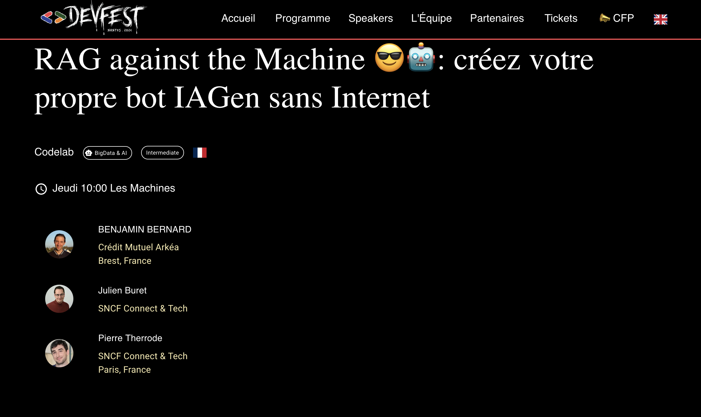

# [Devfest 2024] RAG against the Machine 😎🤖: créez votre propre bot IAGen sans Internet
Ce projet github est issue du workshop fait par [Benjamin Bernard](https://devfest2024.gdgnantes.com/speakers/benjamin_bernard/), [Julien Buret](https://devfest2024.gdgnantes.com/speakers/julien_buret/) et [Pierre Therrode](https://devfest2024.gdgnantes.com/speakers/pierre_therrode/), pour le DevFest 2024, avec comme sujet : [RAG against the Machine 😎🤖: créez votre propre bot IAGen sans Internet](https://devfest2024.gdgnantes.com/sessions/rag_against_the_machine_______creez_votre_propre_bot_iagen_sans_internet/)

## Sommaire

---

- [Introduction: Tock](https://github.com/pi-2r/devfest2024-tock-studio-IA-Gen/tree/step_0)
- [Mise en place de l'environnement](https://github.com/pi-2r/devfest2024-tock-studio-IA-Gen/tree/step_1)
- [Les premiers entrainements du bot](https://github.com/pi-2r/devfest2024-tock-studio-IA-Gen/tree/step_2)
- [Mettons un peu d'IAGen dans notre bot](https://github.com/pi-2r/devfest2024-tock-studio-IA-Gen/tree/step_3)
- [Faire dérailler notre bot](https://github.com/pi-2r/devfest2024-tock-studio-IA-Gen/tree/step_4)
- [Reprendre le contrôle de notre bot](https://github.com/pi-2r/devfest2024-tock-studio-IA-Gen/tree/step_5)
- [Connecter notre bot à notre boutique](https://github.com/pi-2r/devfest2024-tock-studio-IA-Gen/tree/step_6)
- [Bonus: Brancher notre bot sur Messenger](https://github.com/pi-2r/devfest2024-tock-studio-IA-Gen/tree/step_7)
- [Remerciements](https://github.com/pi-2r/devfest2024-tock-studio-IA-Gen/tree/thanks-you)

## Pour aller plus loin
- [Liste de ressources](https://github.com/pi-2r/devfest2024-tock-studio-IA-Gen/tree/resources)

