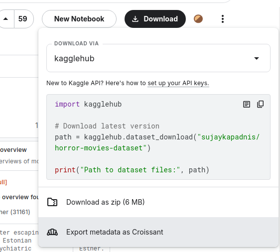

# Préparons notre base documentaire


> "Morpheus is fighting Neo", The matrix, Les Wachowski, 1999

Objectifs:
- Comprendre comment nous allons faire rentrer une base documentaire dans le bot, concept du Retrieval Augmented Generation
- Récupérer un ensemble documentaire, le transformer dans le bon format
- Utiliser les tool d'ingestion pour le vectoriser et charger dans la base documentaire de notre bot

## Sommaire

- [Qu'est-ce que le RAG ?](#qu-est--ce-que-le-rag-?)
- Récupérer une base documentaire (via kaggle)
- Conversion de la base documentaire dans le bon format avec la langage de votre choix (exemple python)
- Découverte du tooling et du format
  - Config d'emdedding
- Ingestion avec le tooling (cli docker a donner)
- [Étape suivante](#étape-suivante)

## Qu'est-ce que le RAG


Imaginez que vous lissez un livre, à chaque idée dans le livre, vous allez arracher la ou les pages pour les placer 
dans un coin de votre piece de votre maison ou appartement (ou un chateau, cela depend de votre budget !). 
Quand un(e) ami(e) vous demande par exemple de quoi parle le chapitre 5 du livre que vous avez-lu, vous allez chercher 
dans le coin de la pièce les pages correspondantes pour lui répondre avec vos propres mots.

Là vous avez lu un livre, imaginez maintenant que vous avez lu des milliers de livres, et que vous avez arraché des 
pages de chaque livre pour les placer dans un coin des différentes piéces de votre domicile. Vous devez incollable !

Maintenant, c'est un programme informatique qui va lire les livres, extraire les idées des pages pour les placer non pas 
dans un coin de votre domicile mais dans une base de données dite vectorielle.
L'extraction d'information utilise une techniques de découpage (embedding) pour placer les idées dans la base de 
données vectorielle (une base de données avec des coins).

Plus les idées sont proches, plus elles sont proches dans la base de données vectorielle.


On a évoqué les livres, mais cela fonctionne parfaitement avec vos documents numérique tel que des articles, des pages web, des documents PDF, des fichiers texte, des bases de données, etc.

Dés lors, le RAG (Retrieving augmented Generation) est une méthode qui permet de répondre (formulé par une IA ou LLM) à une question en se basant sur une base de connaissances, placées dans une base de données vectorielle.


## Trouver un data set sur kaggle

Vous pouvez rechercher n'importe quel dataset de la thématique qui vous intéresse idéalement un dataset avec des URL ou références vous permettant de relier les documents à des versions en ligne.

Dataset proposé sur Kaggle : [Horror Movies dataset](https://www.kaggle.com/datasets/sujaykapadnis/horror-movies-dataset/data) 

Télécharger le dataset en zip et le décompresser dans le dossier `data/documents_csv/`.
Sinon fichier disponibles en local ici **TODO**.




## Découverte du tooling et du format

Pour ingérer ce dataset nous allons utiliser le script [index_documents.py de TOCK documenté ici](https://github.com/theopenconversationkit/tock/tree/master/gen-ai/orchestrator-server/src/main/python/tock-llm-indexing-tools#documents-indexing), il prend en entrée un csv à 3 colonnes (`source|title|text`, séparateur pipe `|`). Il va donc falloir convertir votre fichier dans ce format nous vous conseiller également de filtrer le fichier et vous limiters à un échantillons de 5-15 lignes, l'idée étant de limiter le temps de vectorisation si vous êtes en local (ollama sans GPU).

Format du fichier CSV d'entrée :
```csv
source|title|text
https://www.themoviedb.org/movie/837286|Semangat Ular|Zaiton comes under the influence of the spell cast by a snake spirit. With her body under possession, she incapacitates her father and is lured to a hypnotised rendezvous with the snake spirit in his harem pit. The spirit takes on an anthropomorphised form and charms Zaiton, convincing her that her fiancée Rahim is a philanderer. Rahim and Zaiton’s father turn to a wise shaman to rescue Zaiton.
https://www.themoviedb.org/movie/25886|Graveyard Disturbance|Five young robbers spend a whole night in a dark catacomb to win a priceless treasure. They will have to fight against lots of ferocious zombies and vampires. At the end they will meet the Death in person!
```

Voici un script python qui convertie la dataset donnée en exemple dans ce format de sortie en en gardant qu'une portion. Vous pouvez effectuer ces opération dans le langage de votre choix.

### Exemple de script python utilisant Panda

Ce script est présent dans [data/scripts/transform_horror_movie.py](./data/scripts/transform_horror_movie.py), nous vous proposons une image docker de tooling pour l'exécuter plus bas.


Ce script est volontairement simplifié nous vous invitons à le lire / adapter aux besoins en fonction de votre dataset.
A noter que la colonne "source" peut-être laisée vide si vous n'avez pas de version en ligne du document.

```python
import pandas as pd

# Load the CSV file
df = pd.read_csv('/app/data/documents_csv/horror_movies.csv')

# Set the number of random rows you want to keep
n = 15  # Example value

# Randomly select n rows
df_sampled = df.sample(n=n, random_state=42)  # random_state ensures reproducibility

# Keep only the specified columns
columns_to_keep = ['id', 'title', 'overview']
df_filtered = df_sampled[columns_to_keep]

# Map id column to URLs
df_filtered['id'] = df_filtered['id'].map(lambda x: f"https://www.themoviedb.org/movie/{x}")

# Rename columns
df_filtered.rename(columns={'id': 'source', 'overview': 'text', 'title': 'title'}, inplace=True)

# Save the filtered DataFrame to a CSV file
df_filtered.to_csv('data/documents_csv/filtered_horror_movies.csv', index=False, sep='|')

```

Exécution du script via l'image de tooling :
```bash
# Sourcer vos variables d'environnement
source docker/.env
# Lancer le conteneur de tooling pour exécuter le script
docker run --rm -it \
    -v "$(pwd)/data":/app/data \
    -e NO_PROXY="host.docker.internal,ollama-server,postgres-db,localhost" \
    -e no_proxy="host.docker.internal,ollama-server,postgres-db,localhost" \
    --add-host=ollama-server:$OLLAMA_SERVER \
    --add-host=postgres-db:$POSTGRES_DB_SERVER \
    tock/llm-indexing-tools:$TAG \
    /bin/bash

# Excuter le script
python /app/data/scripts/transform_horror_movie.py

# Vérifiez le contenu du CSV filtré
cat data/documents_csv/filtered_horror_movies.csv
```

## Ingestion avec le tooling

Maintenant que nous avons nos données dans le bon format il est nécessaire de les ingérer dans notre base documentaire. TOCK est compatible avec [OpenSearch](https://github.com/theopenconversationkit/tock-docker/blob/master/docker-compose-rag-opensearch.yml) et PGVector (utilisé dans ce codelab).

L'ingestion consite globalement en 2 grandes étapes :
* Découper les données en chunk de manière à maitriser la taille du contexte documentaire qui sera fourni au LLM
* Vectoriser chacun des chunks à l'aide d'un modèle d'embedding, pour pouvoir chercher les bons morceaux à terme avec la requête utilisateur qui sera elle même vectorisée à l'aide du même modèle.

### Configuration d'embedding

Vous l'avez compris nous avons besoin d'un modèle qui depuis un texte (description d'un film), nous sort un vecteur qui représente ce texte. Nous allons utiliser le modèle [nomic-embed-text](https://ollama.com/library/nomic-embed-text), vous pouvez retrouver d'autres [modèles d'embedding compatible ollama ici](https://ollama.com/search?&c=embedding).

Cette vectorisation intervient à 2 endroit, pour ingérer la base documentaire (configuré à l'aide d'un fichier json fourni au script d'ingestion) et pour donner une représentation de chaque requête utilisateur (ceci sera configuré via les RAG Settings de doc).

#### Configuration avec ollama

La configuration est sous format json :
TODO

#### Configuration avec openai ou Azure OpenAI

TODO

### Lancer l'ingestion

TODO:
- Retrouver le BOT ID
- Retrouver le namespace

```bash
# Sourcer vos variables d'environnement
source docker/.env
# Lancer un shell dans l'image de tooling en mode interactif
docker run --rm -it \
    -v "$(pwd)/data":/app/data \
    -e NO_PROXY="host.docker.internal,ollama-server,postgres-db,localhost" \
    -e no_proxy="host.docker.internal,ollama-server,postgres-db,localhost" \
    --add-host=host.docker.internal:host-gateway \
    --add-host=ollama-server:host-gateway \
    --add-host=postgres-db:host-gateway \
    tock/llm-indexing-tools:24.9.3 \
    /bin/bash
# A l'intérieur du shell de l'image
export TOCK_BOT_ID=
export TOCK_BOT_NAMESPACE=
python tock-llm-indexing-tools/index_documents.py data/documents_csv/filtered_horror_movies.csv <NAMESPACE> <BOT-ID> data/configurations/embeddings_ollama_settings.json data/configurations/vector_store_pgvector_settings.json 5000 -v
```


## Étape suivante

- [Étape 3](step_3.md)
