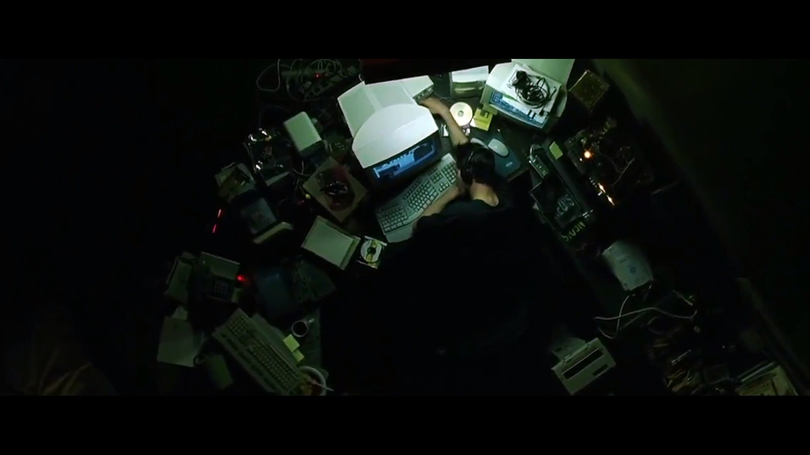
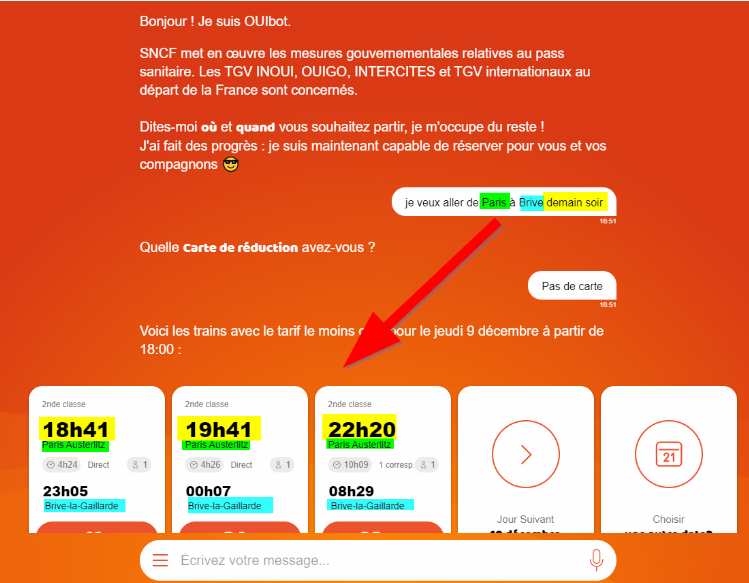

# TOCK: The Open Conversation Kit

> "Follow the white rabbit.", The matrix, Les Wachowski, 1999

##  Tock c'est quoi ?

>Tock, acronyme de The Open Conversation Kit (https://doc.tock.ai/), a été développé au sein de SNCF Connect and Tech (précédemment connu sous le nom de OUI.sncf), dans leur département Innovation. Lancé en 2016 pour le site de vente de billets de train oui.sncf, Tock a révolutionné l'interaction utilisateur en comprenant une recherche écrite via une barre de recherche intuitive, sans nécessiter un formulaire standard.
>
>L'objectif de cette innovation était de simplifier le processus de demande de voyage pour les utilisateurs, permettant au bot de répondre de manière naturelle, comme le ferait un être humain. Par exemple, dans une situation datant de décembre 2020, un voyageur souhaitant se rendre de Paris à Brive le soir suivant pourrait exprimer sa demande au OUIbot.
>
>

>
Ancienne page web de OUIbot permettant de comprendre la demande client et d’en donner un résultat.

> 
>
>Le bot était alors capable de saisir la gare de départ, la destination et le moment souhaité pour le voyage, offrant ainsi des réponses pertinentes et adaptées à l'utilisateur.

