# Mise en place de l'environnement
[](https://www.youtube.com/watch?v=aTL4qIIxg8A)

> "I can feel you now. I know that you're afraid... you're afraid of us. You're afraid of change. I don't know the future.", The matrix, Les Wachowski, 1999


<br/>
<u>Objectifs de cette étape:</u> 

- Installer les dépendances nécessaires pour faire ce CodeLab :
  - Installer **Tock** via **Docker** (pour info on installera **pgvector** et **LangFuse** plus tard durant le lab)
  - Installer **Ollama** en local
- Lancer l'application _Tock Studio_
- Créer un Bot

## Sommaire

- [Dépendance](#docker)


- [Lancer l'environnement avec Docker](#lancer-lenvironnement-avec-docker)


- [Accéder à l'espace admin](#accéder-à-l'espace-admin)
- [Configurer Tock Studio](#configurer-tock-studio)
- [Créer votre 1er Application](#créer-votre-1er-application)
- [Créer votre 1er connecteur web](#créer-votre-1er-connecteur-web)


- [Lancer le bot](#lancer-le-bot)
- [Interroger le bot](#interroger-le-bot)


- [Ressources](#ressources)


- [En attendant la suite du Codelab...](#en-attendant-la-suite-du-codelab)
- [Étape suivante](#étape-suivante)

## Cloner ce repo

Commencez par cloner ce repository :
```bash
git clone https://github.com/pi-2r/devfest2024-tock-studio-IA-Gen.git
cd devfest2024-tock-studio-IA-Gen
```

## Le réseau de l'atelier

L'objectif de cet atelier et de tout faire tourner en local sur votre poste. Pour accélérer encore plus les choses et éviter d'attendre de long temps de téléchargement nous avons monté un réseau local avec les éléments suivants :

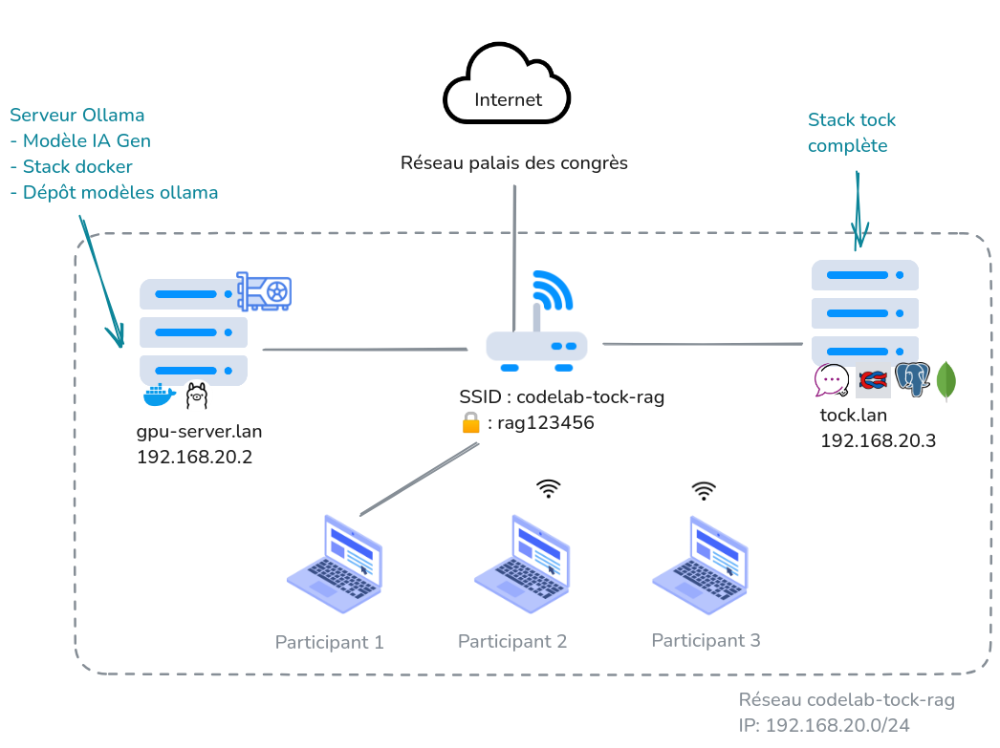

Modifiez votre fichier `/etc/hosts` (Mac / Linux) ou `C:\windows\system32\drivers\etc\hosts` y ajouter les éléments suivants :
```
# Codelab DevFest Tock
192.168.20.2    gpu-server.lan
192.168.20.3    tock.lan
```

Nous ferons référence à ces éléments dans la suite du tutoriel.

## Docker

Nous allons déployer plusieurs outils (Tock, LangFuse) en local grâce à Docker. 
Vous aurez donc besoin d'avoir Docker installé sur votre machine. Le workshop a été testé avec la dernière version.

Vérifiez que Docker est opérationnel :
```bash
docker -v
```
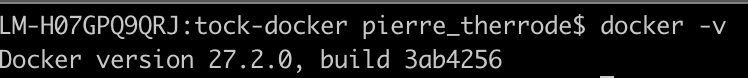

## Configuration globale de l'environnement

Pour information.

Dans le cadre de ce codelab vous allez pouvoir utiliser certains composants en local (ou des instances mises à 
disposition, en cas de difficultés). Tout est configuré dans le fichier `docker/.env` :

> Note: Si vous avez un Mac, il faut utiliser le fichier template-arm64.env

```bash
cp docker/template.env docker/.env
# Sur Mac: cp docker/template-arm64.env docker/.env 
# Pour sourcer les variable dans un terminal
source docker/.env
```

Ce fichier documente toutes les configurations dans la suite du tutoriel vous aurez peut-être besoin d'en modifier si un composants ne marche pas chez vous. Celà sera indiqué dans la suite du tutoriel.


## Lancer l'environnement avec Docker

Vous allez déployer une plateforme Tock avec Docker. A la racine du repo Git du codelab se trouve 
un dossier nomé **docker**. Il contient un fichier descripteur 
docker-compose avec tous les éléments dont vous avez besoin pour ce codelab.

>Note : pour info ce descripteur est adapté de celui fourni avec la distribution Tock sur github : https://github.com/theopenconversationkit/tock-docker.git

### Autorisation de la registry locale insecure

Pour éviter une congestion du réseau nous avons mis les images dans une registry docker local présente sur http://gpu-server:5000/ et configurée dans `docker/.env`. Cette registry n'étant pas en HTTPS vous devez préalablement l'autoriser en tant que registry insecure.

#### Sous linux
Éditer le fichier `/etc/docker/daemon.json` :
```json
{
    "insecure-registries" : [ "gpu-server.lan:5000", "tock.lan:5000" ]
}
```

Relancer docker :
```bash
sudo systemctl restart docker.service
```

#### Sous MacOS / Windows
Depuis docker desktop aller dans les paramètres puis Docker Engine et éditer la configuration json de la même manière que sous linux.

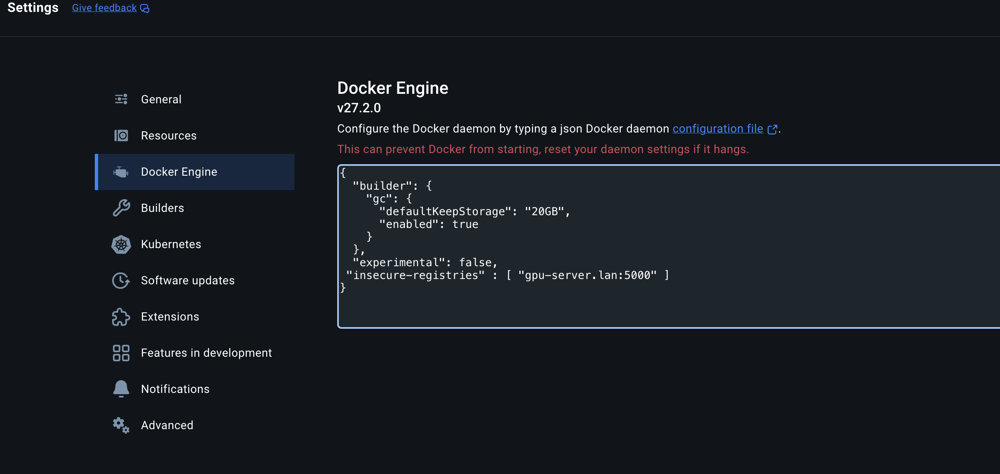

### Lancement de la stack

Depuis la racine de ce dossier, appliquez ces 3 commandes :

```bash
cd docker
source .env
chmod a+r scripts/init-pgvect.sql # Quid sous windows ?
docker compose -p devfest_tock up -d
```

Une fois que tout est lancé, vous devriez avoir ce rendu au niveau des ressources si vous avez docker-desktop:

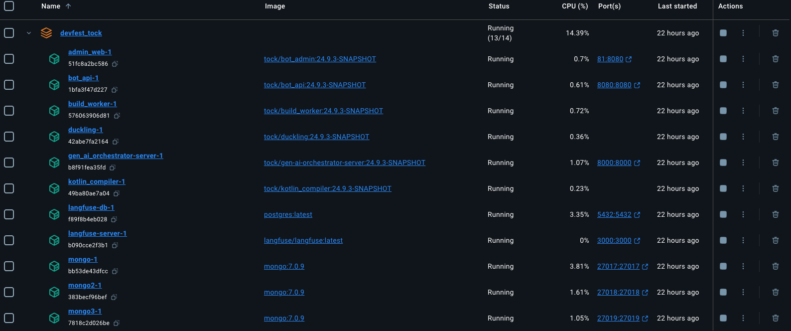

Si vous n’avez pas docker-desktop, vous pouvez lancer la commande docker suivante pour vous assurer que tous les 
éléments sont bien démarrés.

```bash
docker compose -p devfest_tock ps
```

Vous devriez avoir ce rendu :


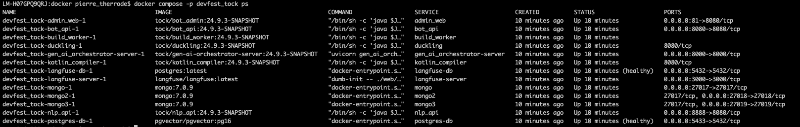


>Information Importante : 
> 
> Si votre machine est trop faible pour supporter l’environnement Tock avec tous ces composants IA Gen, vous pouvez nous 
> demander un accès sur l’une des machines des animateurs du Codelab. Dans ce cas, il faudra que vous changiez le nom de
> votre application (voir étape : Créer votre 1er Application) par un autre nom (par exemple les 3 premières lettres de 
> votre nom).

### ⚠️ Fallback : j'ai pas docker, j'arrive pas à pull la stack

Pas de soucis nous mettons à disposition sur le réseau du codelab une stack complète de TOCK, TOCK étant multi-bot vous pourrez travailler à plusieurs dessous.

Pour accéder au tock studio sur cette stack allez sur : http://tock.lan

Modifiez votre fichier `docker/.env`, lignes suivantes :
```bash
# PostgresDB
#   export POSTGRES_DB_SERVER=host-gateway # LOCAL tock stack
#   export POSTGRES_DB_SERVER=192.168.20.3 # OUR CODELAB, remote tock stack at tock.lan, unfornately docker compose needs an IP addr
export POSTGRES_DB_SERVER=192.168.20.3 # OUR CODELAB, remote tock stack at tock.lan, unfornately docker compose needs an IP addr
```

N'hésitez pas à arrêter la stack docker et supprimer les ressources créés :
```bash
cd docker
source .env
docker compose -p devfest_tock down -v
```

 
### Accéder à l'espace admin

Pour accéder à l'espace admin, ouvrez votre navigateur et tapez l'adresse suivante : http://localhost:80 (ou http://tock.lan si vous n'avez pas pu faire tourner la stack docker) et vous devriez arriver sur la page de login de Tock Studio.
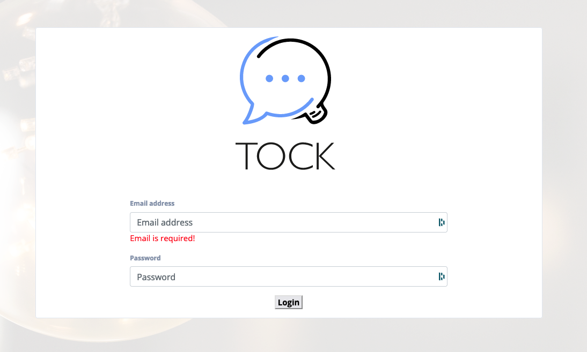

Pour se connecter, utilisez les identifiants suivants :
- username : admin@app.com
- password : password

> **Note 1** :
> Les identifiants sont par défaut dans le code source: https://github.com/theopenconversationkit/tock/blob/master/shared/src/main/kotlin/security/auth/PropertyBasedAuthProvider.kt

> **Note 2** :
> Toutes les variables d'environnement sont définies par le mot clé "**tock_**" (ex: tock_user, tock_password, ..).


## Configurer Tock Studio

Au premier accès à Tock Studio, un assistant simplifié permet de créer un premier assistant (automatiquement nommé 
_new_assistant_).

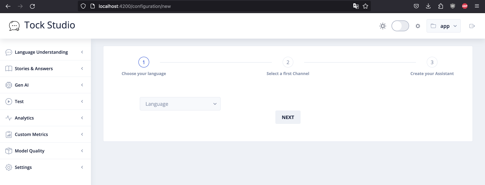

- A l'étape 1,**Choose your language** sélectionnez la langue **English** et cliquer sur le bouton **Next**.

- A l'étape 2, **Select a first Channel**, choisissez **Web** et cliquez sur le bouton **Next**.

- A l'étape 3, **Create your Assitant**, cliquez sur le bouton **Create**.


## Créer votre 1er Application

On va maintenant créer pour le Codelab une application nommée _devfest2024_ (car plusieurs bots peuvent coexister dans une instance de plateforme Tock).

Dans la section **Settings > Applications**, cliquez sur **+ NEW APPLICATION** et remplissez les champs comme dans cet exemple :

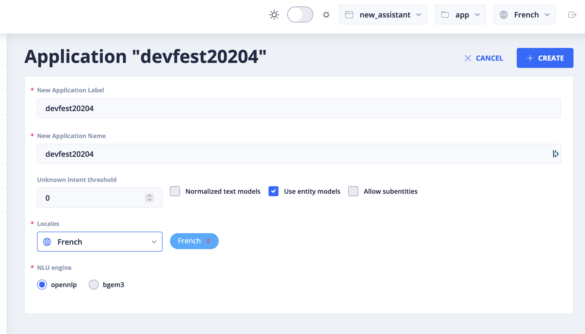

Terminez avec le bouton **CREATE**.

## Créer votre 1er connecteur web

On va créer un premier "endpoint" pour pouvoir interagir avec le bot. 
Chaque endpoint correspond à une API avec un protocole précis, permettant par exemple d'intégrer un bot
à plusieurs canaux externes comme Slack, WhatsApp, Messenger, etc. qui ne parlent évidemment pas le même langage.

On peut attacher (et retirer) autant de endpoints qu'on veut à un bot. On parle pour cela de 
_configurations_ ou _connecteurs_.

Le endpoint le plus simple pour parler à un bot Tock est le **connecteur Web**.

Dans la section **Settings** > **Configurations**, cliquez sur **+ NEW CONFIGURATION** et sélectionnez le type **Web**
et terminez par **Create**. Le bot sera alors accessible à l'URL /io/app/devfest2024/web


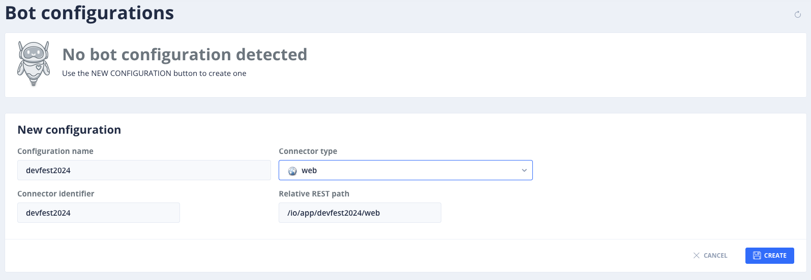


## Interroger le bot

Il est temps de parler à notre bot, on va pour cela utiliser une page Web toute simple, embarquant un petit kit de connexion 
à un bot Tock (fourni dans la distribution sur GitHub) et bien sûr un navigateur Web.

Il existe 2 kits fournis pour intégrer un bot Tock dans une page via React ou Vue.
Choisissez l'une de ces deux pages présentes dans le repo Git et ouvrez-la dans votre navigateur Web 
(par exemple avec CTRL + O > ouvrir le fichier) pour dialoguer avec le bot :
* Page web avec [Tock React Kit](https://github.com/theopenconversationkit/tock-react-kit) 👉 [index.html](index.html)
* Page web avec [Tock Vue Kit](https://github.com/theopenconversationkit/tock-vue-kit) 👉 [index-tvk.html](index-tvk.html)

Si votre instance Tock n'est pas déployée en local, ou que vous avez modifié l'URL du connecteur à l'étape précédente,
vous devrez peut-être modifier l'URL dans la source de la page Web (ligne commençant par `TockReact.renderChat`).
Le format de l'URL est le suivant : `http://localhost:8080/io/<NAMESPACE>/<BOTID>/web`.
Si vous utilisez la stack Tock mutualisée dans la salle du Codelab (ie. pas votre propre instance en local),
 utilisez cette URL : `http://tock.lan:8080/io/<NAMESPACE>/<BOTID>/web`.

> Si besoin, vous pouvez retrouver votre `<NAMESPACE>` et `<BOTID>` en haut à droite dans Tock Studio, ou dans le menu 
> **Settings > Applications :
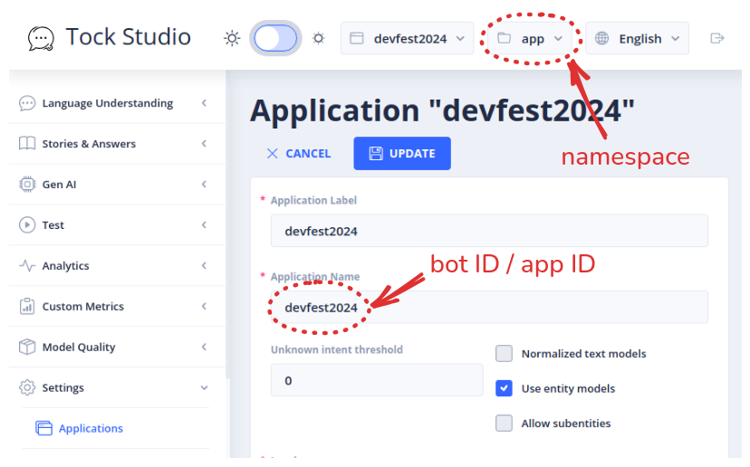

> Note : 
> 
> Pour vous mettre dans l’ambiance Matrix (à vos risque et périls ;), essayez **Activer Matrix** en haut à droite une
> fois la page index ouverte.

## Ressources

Si vous voulez en savoir plus sur les outils installés, n'hésitez pas à visiter leurs sites officiels.

| Information                     | Lien                                                                           |
|---------------------------------|--------------------------------------------------------------------------------|
| Tock                            | [https://doc.tock.ai](https://doc.tock.ai)                                     |
| Docker                          | [https://www.docker.com/](https://www.docker.com/)                             |
| A Docker Tutorial for Beginners | [https://docker-curriculum.com/](https://docker-curriculum.com/)               |
| IntelliJ                        | [https://www.jetbrains.com/fr-fr/idea/](https://www.jetbrains.com/fr-fr/idea/) |
| Ollama                          | [https://ollama.com/](https://ollama.com/)                                     |


## En attendant la suite du Codelab...

[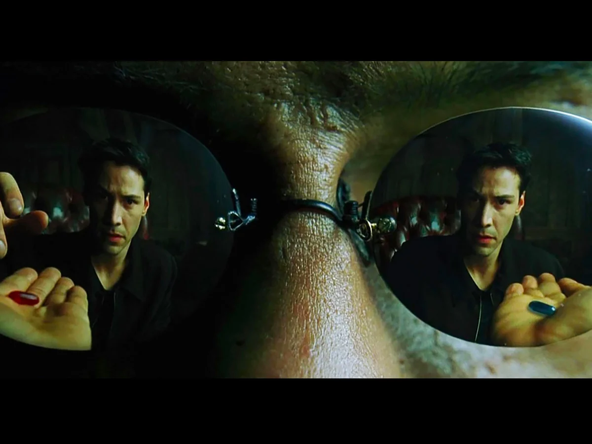](https://www.youtube.com/watch?v=bNWY5Bd_KOA)

## Étape suivante

- [Étape 2](step_2.md)


