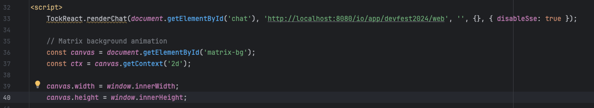

# Mise en place de l'environnement
[](https://www.youtube.com/watch?v=aTL4qIIxg8A)

> "I can feel you now. I know that you're afraid... you're afraid of us. You're afraid of change. I don't know the future.", The matrix, Les Wachowski, 1999


<br/>
<u>Objectifs de cette étape:</u> 

- Installer les dépendances nécessaires pour faire ce CodebLab
- Installer Tock sur sa machine avec Docker
- Lancer l'espace admin depuis la stack Docker
- Créer votre 1er Application

## Sommaire

- [Dépendance](#dépendance)
- [Installer Ollama](#installer-ollama)
  - [Installation depuis le Codelab](#installation-depuis-le-codelab)
    - [Récupérer les modèles pour l'atelier sur la machine GPU](#récupérer-les-modèles-pour-latelier-sur-la-machine-gpu)
    - [Autorisation de la registy locale insecure](#autorisation-de-la-registry-locale-insecure)
      - [Sous linux](#sous-linux)
      - [Sous MacOS / Windows](#sous-macos--windows)
  - [Récupérer les modèles depuis internet hors du Codelab](#récupérer-les-modèles-depuis-internet-hors-du-codelab)
  - [Tester avec un petit prompt](#tester-avec-un-petit-prompt)
- [Lancer l'environnement avec Docker](#lancer-lenvironnement-avec-docker)
- [Accéder à l'espace admin](#accéder-à-l'espace-admin)
- [Configurer Tock Studio](#configurer-tock-studio)
- [Créer votre 1er Application](#créer-votre-1er-application)
- [Créer votre 1er connecteur web](#créer-votre-1er-connecteur-web)
- [Lancer le bot](#lancer-le-bot)
- [Interroger le bot](#interroger-le-bot)
- [Ressources](#ressources)
- [En attendant la suite du Codelab...](#en-attendant-la-suite-du-codelab)

## Le réseau de l'atelier

L'objectif de cet atelier et de tout faire tourner en local sur votre poste. Pour accélérer encore plus les choses et éviter d'attendre de long temps de téléchargement nous avons monté un réseau local avec les éléments suivants :


Modifiez votre fichier `/etc/hosts` (Mac / Linux) ou `C:\windows\system32\drivers\etc\hosts` y ajouter les éléments suivants :
```
# Codelab DevFest Tock
192.168.20.2    gpu-server.lan
192.168.20.3    tock.lan
```

Nous ferons référence à ces éléments dans la suite du tutoriel.

## Dépendance

Assurez-vous d'avoir Docker sur votre machine. Ce workshop a été testé avec la dernière version Docker.
```bash
docker -v
```


Docker doit aussi être fonctionnel sur votre machine.


## Installer Ollama

Pour installer Ollama, vous devez aller sur le lien suivant : https://ollama.com/ et suivre les instructions pour télécharger Ollama sur votre machine. Une fois que cela est fait, dézipper le fichier et installer le programme sur votre machine. A la fin de l’installation Ollama vous conseil d’installer un model sur votre machine. Ce modèle fait plus de 6Go, et nous n’allons pas en avoir besoin. Il faut donc décliner le téléchargement de ce modèle.


### Récupérer les modèles pour l'atelier sur la machine GPU

Pour éviter de congestionner le réseau, nous avons pré-téléchargé les modèles pour voir.

* Télécharger l'archive :
  * Version light si vous n'avez pas de GPU ou peu d'espace disque disponible http://gpu-server.lan/ollama_models/tinyllama_nomic-embed-text.zip
* Décompresser l'archive dans :
  * macOS: `~/.ollama/models`
  * Linux: `/usr/share/ollama/.ollama/models`
  * Windows: `C:\Users\%username%\.ollama\models`

**TODO préparer l'archive et tester cette étape !!!**

### Récupérer les modèles depuis internet hors du Codelab

```
ollama pull tinyllama
ollama pull nomic-embed-text
```

### Tester avec un petit prompt

```bash
ollama run tinyllama
```

Une fois ce modèle téléchargé et toujours dans le terminal vous pouvez tester/jouer avec le model ou quitter 
l’environnement en appuyant sur CTRL + D.

> **Note** : Vous pouvez aussi télécharger le modèle nomic-embed-text pour le codelab. Pour cela, vous pouvez lancer la commande suivante :
```bash 
ollama run nomic-embed-text
```

### ⚠️ Fallback : Ollama ne marche pas

Installation trop lente ? ça rame .... pas de soucis vous allez pouvoir utiliser le serveur Ollama présent sur **http://gpu-server.lan:11434**.
N'installez pas Ollama passez à la suite.

## Lancer l'environnement avec Docker

Vous allez monter un environnement Tock sur Docker. Il y a un dossier nomé **docker**, qui contient un fichier 
docker-compose avec tous les éléments dont vous avez besoin pour ce codelab.

>Note : ce fichier docker-compose est inspiré du répertoire github : https://github.com/theopenconversationkit/tock-docker.git

Pour éviter une congestion du réseau nous avons mis les images dans une registry docker local présente sur http://gpu-server:5000/ et configurée dans `docker/.env`. Cette registry n'étant pas en HTTPS vous devez préalablement l'autoriser en tant que registry insecure.

### Autorisation de la registry locale insecure

### Sous linux
Éditer le fichier `/etc/docker/daemon.json` :
```json
{
    "insecure-registries" : [ "gpu-server:5000" ]
}
```

### Sous MacOS / Windows
Depuis docker desktop aller dans les paramètres puis Docker Engine et éditer la configuration json de la même manière que sous linux.

### Lancement de la stack

Depuis la racine de ce dossier, appliquez ces 3 commandes :

```bash
cd docker
chmod a+r scripts/init-pgvect.sql # Quid sous windows ?
docker compose -p devfest_tock up -d
```

Une fois que tout est lancé, vous devriez avoir ce rendu au niveau des ressources si vous avez docker-desktop:


Si vous n’avez pas docker-desktop, vous pouvez lancer la commande docker suivante pour vous assurer que tous les 
éléments sont bien démarrés.

```bash
docker compose -p devfest_tock ps
```

Vous devriez avoir ce rendu :


>Information Importante : 
> 
> Si votre machine est trop faible pour supporter l’environnement Tock avec tous ces composants IA Gen, vous pouvez nous 
> demander un accès sur l’une des machines des animateurs du Codelab. Dans ce cas, il faudra que vous changiez le nom de
> votre application (voir étape : Créer votre 1er Application) par un autre nom (par exemple les 3 premières lettres de 
> votre nom).

### ⚠️ Fallback : j'ai pas docker, j'arrive pas à pull la stack

Pas de soucis nous mettons à disposition sur le réseau du codelab une stack complète de TOCK, TOCK étant multi-bot vous pourrez travailler à plusieurs dessous.

Pour accéder au tock studio sur cette stack allez sur : http://tock.lan

 
### Accéder à l'espace admin

Pour accéder à l'espace admin, ouvrez votre navigateur et tapez l'adresse suivante : http://localhost:80 et vous devriez arriver sur la page de login de Tock Studio.


Pour se connecter, utilisez les identifiants suivants :
- username : admin@app.com
- password : password

> **Note 1** :
> Les identifiants sont par défaut dans le code source: https://github.com/theopenconversationkit/tock/blob/master/shared/src/main/kotlin/security/auth/PropertyBasedAuthProvider.kt

> **Note 2** :
> Toutes les variables d'environnement sont définies par le mot clé "**tock_**" (ex: tock_user, tock_password, ..).


## Configurer Tock Studio


- A l'étape 1,**Choose your language** sélectionnez la langue **English** et cliquer sur le bouton **Next**.

- A l'étape 2, **Select a first Channel**, choisissez **Web** et cliquez sur le bouton **Next**.

- A l'étape 3, **Create your Assitant**, cliquez sur le bouton **Create**.


## Créer votre 1er Application

Dans la section Settings, cliquez sur le bouton **+ NEW APPLICATION**. Remplissez les champs requis comme dans l'exemple
suivant :


Une fois cela fait, cliquez sur le bouton **CREATE**.

## Créer votre 1er connecteur web

Dans la section **Settings** > **CONFIGURATIONS**, cliquez sur le bouton **+ NEW CONFIGURATION** pour créer, comme dans
l'exemple suivant un connecteur web avec comme endpoint /io/app/devfest2024/web


Une fois cela fait, cliquez sur le bouton **CREATE**.


## Interroger le bot

Dans ce projet et une fois toutes les étapes précédemment réalisées, vous pouvez ouvrir les 
fichiers [index.html](index.html) depuis votre navigateur et commencer à dialoguer avec le bot.

Si le fond d’écran animé vous gêne, vous pouvez commenter la ligne 36 qui contient l’élément suivant :

```html
const canvas = document.getElementById('matrix-bg');
```




## Ressources

| Information                       | Lien                                                                           |
|-----------------------------------|--------------------------------------------------------------------------------|
| Tock Studio                       | [https://doc.tock.ai](https://doc.tock.ai)                                     |
| Docker                            | [https://www.docker.com/](https://www.docker.com/)                             |
| A Docker Tutorial for Beginners   | [https://docker-curriculum.com/](https://docker-curriculum.com/)               |
| IntelliJ                          | [https://www.jetbrains.com/fr-fr/idea/](https://www.jetbrains.com/fr-fr/idea/) |
| Ollama                            | [https://ollama.com/](https://ollama.com/)                                     |


## En attendant la suite du Codelab...

[](https://www.youtube.com/watch?v=bNWY5Bd_KOA)


