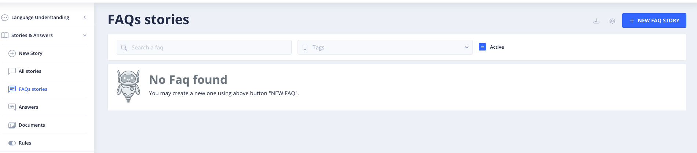
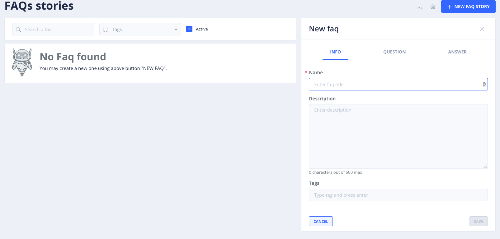
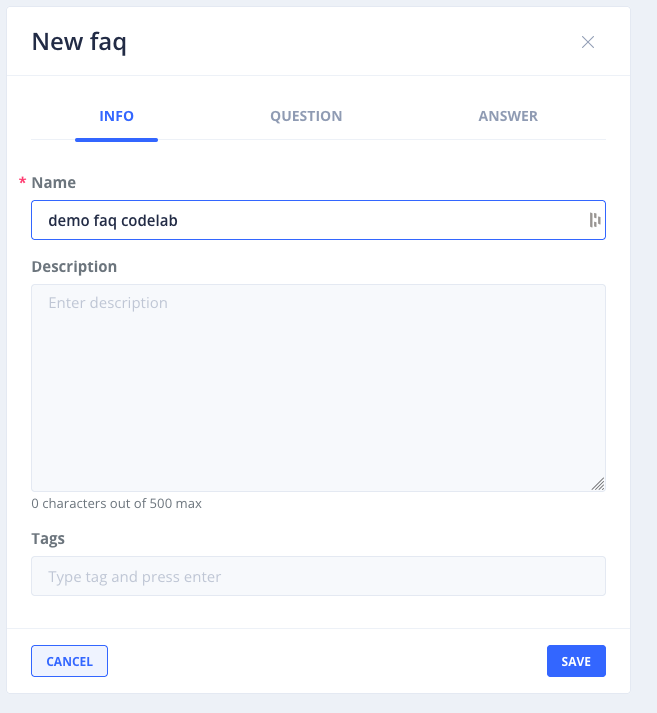
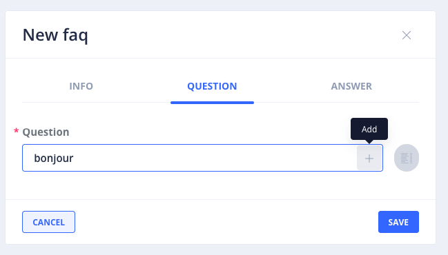
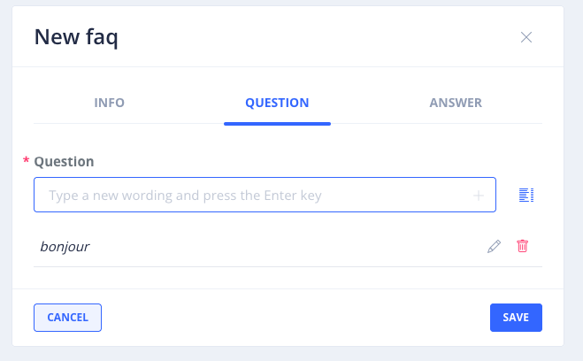
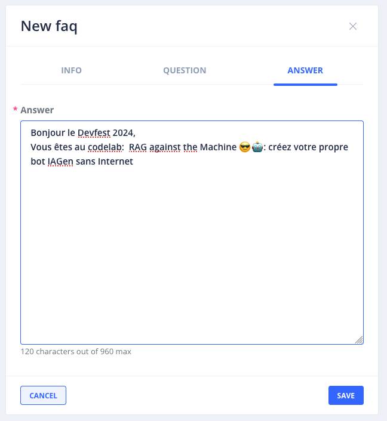
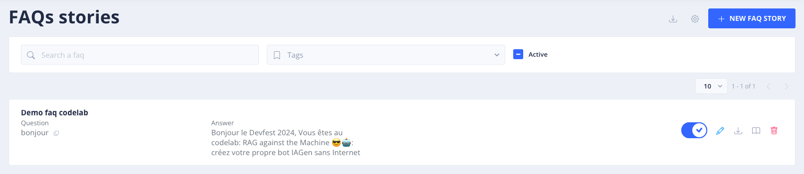
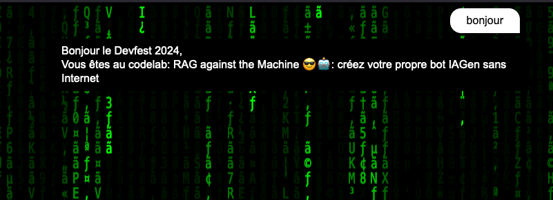
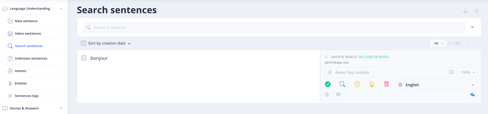
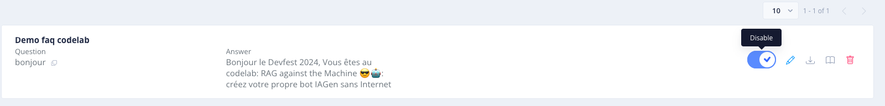

# Les premiers entrainements du bot

[](https://www.youtube.com/watch?v=fhrNgXJ__n8)

> "I know Kung fu.", The matrix, Les Wachowski, 1999


<br/>
<u>Objectifs:</u>

- Découvrir l'interface de Tock Studio
- Discuter avec le bot et voir les messages remonter dans Tock Studio
- Créer une intention et une story
- Qualifier une phrase (apprentissage supervisé)

## Sommaire

- [Aperçu de l'interface Tock Studio](#aperçu-de-linterface-tock-studio)


- [Discuter avec bot](#discuter-avec-bot)
- [Ajuster l'URL du bot API](#ajuster-lurl-du-bot-api)
- [Dialoger avec le bot](#dialoger-avec-le-bot)
- [Créer FAQ](#créer-faq)
- [Tester la FAQ](#tester-la-faq)
- [Désactiver la FAQ](#désactiver-la-faq)


- [Ressources](#ressources)
- [Étape suivante](#étape-suivante)

## Aperçu de l'interface Tock Studio


L'interface de Tock Studio est composée de plusieurs sections (à gauche dans l'interface) :

- <u>**Language Understanding**:</u> pour voir les _phrases_ que le bot a reçues, comment elles ont été comprises (_qualifiées_), gérer les _intentions_ et _entités_.
- <u>**Stories & Answers**:</u> pour créer des réponses, des parcours, des arbres de décision, etc. Les _stories_ ("skills" dans d'autres frameworks) sont des scénarios déclenchés par une _intention_.
- <u>**Gen AI**:</u> pour gérer les paramètres en mode IA Générative.
- <u>**Test**:</u> pour tester votre bot sans avoir à passer par son API ou un canal externe. Ecrivez des phrases et voyez comment il vous répond.
- <u>**Analytics**:</u> différents outils et dashboards de statistiques sur le trafic de votre bot.
- <u>**Custom Metrics**:</u> pour créer des métriques personnalisées, afin de mieux suivre les performances de votre bot.
- <u>**Model Quality**:</u> pour analyser les performances du modèle NLP de votre bot, vérifier sa pertinence dans le temps.
- <u>**Settings**:</u> pour configurer les éléments les plus structurants de vos différents bots (_applications_) et canaux (_configurations_ et _connecteurs_).

## Discuter avec bot

Dans un premier temps, nous allons commencer par discuter avec le bot.
Depuis votre page de test nommée [index.html](index.html)

### Ajuster l'URL du bot API

Si votre bot ne répond pas, ajustez l'URL dans les sources de la page Web. Les messages sont envoyés par le composant Web
embarqué dans la page à l'API du Bot, exposée par le connecteur web (ie. une API REST cf architecture ci-dessous).

Vous pouvez retrouver l'URL de votre bot dans Tock Studio : **Settings** > **Configurations** > déplier le connecteur web > **Relative REST path**.

Adaptez l'url `http://localhost:8080/io/app/devfest2024/web` dans le code au niveau suivant :
```html
<script>
    TockReact.renderChat(document.getElementById('chat'), 'http://localhost:8080/io/app/devfest2024/web', '', {}, { disableSse: true });
    //....
</script>
```

*Si vous utilisez une stack TOCK non présente sur votre machine (celle exposée sur le post du Codelab), ajustez le fqdn (Fully Qualified Domain) en remplaçant `http://localhost:8080/io/app/devfest2024/web` par `http://tock.lan:8080/io/VOTRE_NAMESPACE/VOTRE_BOT_ID/web`, le chemin est présent dans le studio sur la config du connecteur web.

### Dialoger avec le bot

Vous pouvez dire bonjour à votre bot et voir ce qu'il vous répond.


C'est un peu décevant ? En même temps c'est normal, vous n'avez encore rien appris à votre bot.

### Créer FAQ

Allez dans la partie **Stories & Answers** > **FAQs stories** pour créer notre première interaction avec le bot.




Cliquez sur le bouton bleu **+NEW FAQ STORY** pour voir apparaitre cet écran



Donnez un nom à votre FAQ, pour nous se sera : **demo faq codelab**



Cliquez ensuite sur l’onglet **QUESTION**

Dans le champ **Question**, écrivez **bonjour** puis cliquer sur **ADD**



Vous devriez avoir ce rendu :



Ensuite, cliquez sur **ANSWER** pour ajouter une réponse à la question **bonjour**.
Copiez-collez le texte suivant dans le champ **Answer** :

```
Bonjour le Devfest 2024,
Vous êtes au codelab:  RAG against the Machine 😎🤖: créez votre propre bot IAGen sans Internet
```

Vous devriez avoir ce rendu :



Puis cliquez sur le bouton **SAVE** pour enregistrer votre FAQ et ainsi avoir ce rendu :



### Tester la FAQ

Depuis la page de test [index.html](index.html), si vous retester à nouveau en écrivant **Bonjour**, vous verrez que le 
bot vous répondra ce qu’il a appris.




>Note : si vous souhaitez retrouver les exemples de phrases que vous avez donné à votre bot, vous pouvez aller dans 
> la partie **Language Understanding** > **Search sentences**.





### Désactiver la FAQ

On pourrait utiliser les **stories** et la **FAQ** pour apprendre tout un tas de choses au bot, et améliorer progressivement
sa compréhension (bien qualifier les nouvelles phrases, ie. les associer à la bonne intention/réponse).

Ce sont les mécanismes de base des bots NLP classiques, utilisant des modèles de Machine Learning plus anciens que les 
modèles de fondation / LLM et l'IA Générative. Quand vous avez créé un nouveau bot, dans l'écran de configuration initiale
vous avez peut-être noté plusieurs technologies NLP disponibles par défaut : OpenNLP (Apache), CoreNLP (Stanford), etc. 
Ces briques NLP opensource motorisent pour le moment les premières réponses de votre bot.

Dans la suite du Codelab, on va tirer parti de modèles d'IA Générative pour des résultats bien plus pertinents 
et "créatifs".

A ce stade, nous vous proposons donc de désactiver votre FAQ. Retournez dans 
**Stories & Answers** > **FAQs stories**, puis cliquez sur **Disable** afin de griser l'option.



## Ressources

| Information                                                                   | Lien |
|-------------------------------------------------------------------------------|------|
| Tock                                                                          | [https://doc.tock.ai/tock/](https://doc.tock.ai/tock/) |
| NLP (ou TALN en Français)                                                     | [https://fr.wikipedia.org/wiki/Traitement_automatique_des_langues](https://fr.wikipedia.org/wiki/Traitement_automatique_des_langues) |
| Apache OpenNLP                                                                | [https://opennlp.apache.org/](https://opennlp.apache.org/) |
| Stanford CoreNLP                                                              | [https://stanfordnlp.github.io/CoreNLP/](https://stanfordnlp.github.io/CoreNLP/) |
| Facebook Duckling                                                             | [https://github.com/facebook/duckling](https://github.com/facebook/duckling) |
| Comment les I.A. font-elles pour comprendre notre langue ? (ScienceEtonnante) | [https://www.youtube.com/watch?v=CsQNF9s78Nc](https://www.youtube.com/watch?v=CsQNF9s78Nc) |


## Étape suivante

[Étape 3](step_3.md)
