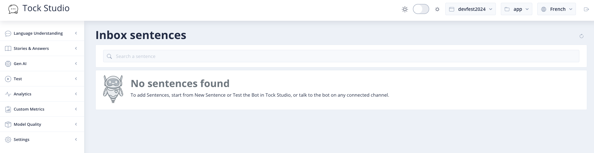
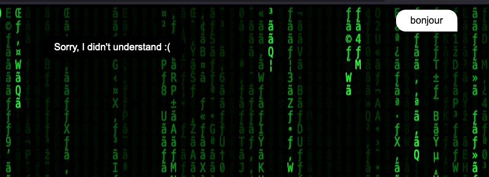
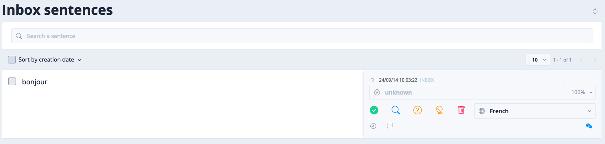
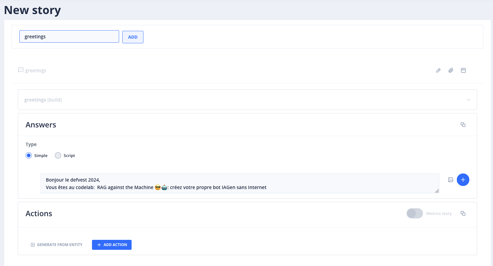
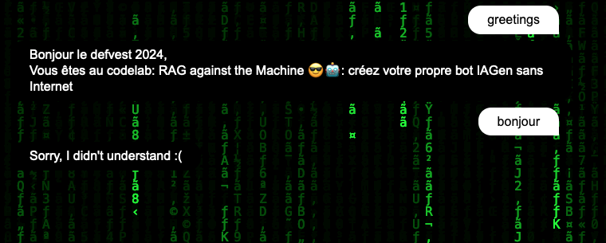

# Les premiers entrainements du bot

[](https://www.youtube.com/watch?v=fhrNgXJ__n8)

> "I know Kung fu.", The matrix, Les Wachowski, 1999


<br/>
<u>Objectifs:</u>

- Découvrir l'interface de Tock Studio
- Discuter avec le bot et voir où les messages sont affichés
- Créer une intention
- Créer une story
- Qualifier une phrase ou un mot

## Sommaire

- [Aperçu de l'interface Tock Studio](#aperçu-de-linterface-tock-studio)
- [Discuter avec bot](#discuter-avec-bot)
- [Créer une story](#créer-une-story)
- [Les premieres phases de qualifications](#les-premieres-phases-de-qualifications)
- [Ressources](#ressources)

## Aperçu de l'interface Tock Studio



L'interface de Tock Studio est composée de plusieurs parties :

- <u>**Language Understanding**:</u> C'est la partie où l'on peut voir les phrases que le bot a reçu et les intentions qui ont été qualifiées.
- <u>**Stories & Answers**:</u> C'est la partie qui permet de créer des stories. Les stories sont des scénarios qui permettent de répondre à une intention.
- <u>**Gen AI**:</u> C'est la partie qui permet de gérer les paramètres de l'IA Générative.
- <u>**Test**:</u> C'est la partie qui permet de tester votre bot. Vous pouvez tester votre bot en écrivant des phrases et voir comment il vous répond.
- <u>**Analytics**:</u> C'est la partie qui permet de voir les statistiques de votre bot. 
- <u>**Custom Metrics**:</u> C'est la partie qui permet de créer des métriques personnalisées. Vous pouvez créer des métriques personnalisées pour suivre les performances de votre bot.
- <u>**Model Quality**:</u> C'est la partie qui permet de voir la qualité du modèle de votre bot.
- <u>**Settings**:</u> C'est la partie qui permet de configurer votre bot.

## Discuter avec bot

Dans un premier temps, nous allons commencer par discuter avec le bot.
Depuis votre page de test nomée [index.html](index.html)

### Ajuster l'URL du bot API

Si votre bot ne répond pas ajuster l'URL, les messages du front de tchat sont envoyés au Bot API qui expose le 
connecteur web, un API Rest (cf architecture ci-dessous).

Vous trouverez l'URL du connecteur web de votre bot dans le Studio : **Settings** > **Configurations** > déplier le connecteur web > Relative REST path.

Adapter l'url `http://localhost:8080/io/app/devfest20204/web` dans le code au niveau suivant :
```html
<script>
    TockReact.renderChat(document.getElementById('chat'), 'http://localhost:8080/io/app/devfest20204/web', '', {}, { disableSse: true });
    //....
</script>
```

*Si vous utilisez une stack TOCK non présente sur votre machine (celle exposée sur le post du codelab) ajuster le fqdn (Fully Qualified Domain) en remplaçant `http://localhost:8080/io/app/devfest2024/web` par `http://tock.lan:8080/io/VOTRE_NAMESPACE/VOTRE_BOT_ID/web`, le chemin est présent dans le studio sur la config du connecteur web.
### Dialoger avec le bot
Vous pouvez directement écrire le message bonjour et voir ce qu'il vous répond.




Si vous recommencez, vous verrez que le bot vous répond toujours la même chose. C'est normal, il n'a pas encore appris a vous répondre autre chose.

> Il existe un autre moyen de tester le bot depuis l'interface Tock Studio. A vous de le découvrir.


En allant dans l'interface de Tock Studio, vous pouvez voir votre message dans la partie **Language Understanding** > 
**Inbox sentences** et voir que votre question est qualifiée avec une intention '**unknown**'.



Pour créer une nouvelle **intention**, vous pouvez cliquer sur la petite boussole grise qui affiche le texte **Create New intent** et donner un nom à votre intention. Par exemple, **hello**. Puis cliquez sur l'icône verte **Validate** pour qualifier le mot Bonjour

Depuis la page de test [index.html](index.html), si vous retester à nouveau en écrivant **Bonjour**, vous verrez que le bot vous répondra toujours la même chose. C'est normal, il n'a pas encore appris à vous répondre autre chose.

Pour ce faire, vous devez créer une **story** qui permettra de répondre à la notion du bonjour.

### Créer une story

Allez dans la partie **Stories & Answers** de Tock Studio et cliquez sur l'onglet **New Story**.
Vous pouvez donner un nom à votre story, par exemple **greetings**, dans la partie **Answer** vous pouvez écrire 
cette phrase :

```
Bonjour le defvest 2024,
Vous êtes au codelab:  RAG against the Machine 😎🤖: créez votre propre bot IAGen sans Internet
```

Où inventer une réponse que le bot doit donner lorsqu'il reçoit l'intention **greetings**.



Dès que vous avez fini de créer votre story, vous pouvez cliquer sur le bouton vert **CREATE STORY** pour valider votre story.


Une fois que vous avez créé votre story, vous pouvez retourner sur la page de test [index.html](index.html) et écrire **greetings**.
Vous verrez que le bot vous répondra avec la réponse que vous avez créée.
Toutefois, si vous écrivez autre chose, comme par exemple "bonjour", le bot vous répondra qu'il ne comprend pas.
C'est normal, il n'a pas encore appris à répondre à d'autres questions.



### Les premieres phases de qualifications

Lorsque vous souhaitez que le bot apprenne à reconnaître une intention, vous devez lui donner des exemples de phrases qui correspondent à cette intention.
Pour ce faire, vous pouvez aller dans la partie **Language Understanding** > **Inbox sentences** et choisissez une phrase qui correspond à l'intention que vous avez créée.

Par exemple, si vous avez créé l'intention **greetings**, vous pouvez choisir une phrase qui correspond à cette intention.
Par exemple, **Bonjour**, **Salut**, **Hello**.


>Note : si vous souhaitez retrouver les exemples de phrases que vous avez donné à votre bot, vous pouvez aller dans 
> la partie **Language Understanding** > **Search sentences**.

## Ressources

| Information                              | Lien |
|------------------------------------------|------|
| Tock Studio                              | [https://doc.tock.ai/tock/](https://doc.tock.ai/tock/) |
| NLP (Traitement automatique des langues) | [https://fr.wikipedia.org/wiki/Traitement_automatique_des_langues](https://fr.wikipedia.org/wiki/Traitement_automatique_des_langues) |
