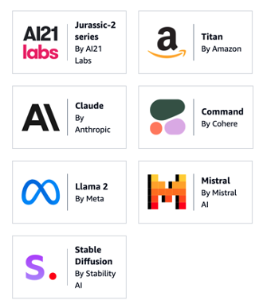
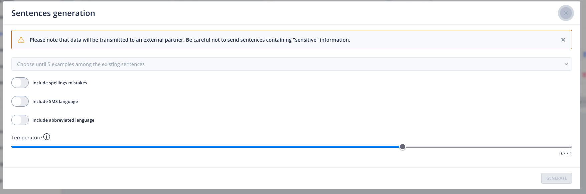

# Accélérons l'entrainement avec de l'IAGen


> "Good, adaptation, improvisation. But your weakness is not your technique.", The matrix, Les Wachowski, 1999

Objectifs:
- Comprendre ce qu'est un LLM
- Activer et configurer un LLM Engine
- Lancer les 1ères générations de phrase pour entrainer plus rapidement le model
- Découvrir un outil d'observabilité des LLM: Langfuse, créer une organisation et un projet pour obtenir les clés d’API
- Brancher Tock Studio sur Langfuse pour observer les performances du modèle
- Tester le rendu de génération de phrase et regarder le rendu dans langfuse

## Sommaire

- [Introduction](#introduction)
  - [Qu'est-ce que le LLM ?](#quest-ce-que-le-llm)  


- [Gen AI - Sentence generation](#gen-ai---sentence-generation)
  - [Ollama](#Ollama)
      - [configuration sous Linux](#configuration-sous-linux)
      - [configuration sous MacOs](#configuration-sous-macos)
      - [Tester l'accès à Ollama](#tester-laccès-à-ollama)
      - [Configurer Ollama dans le generate sentence](#configurer-ollama-dans-le-generate-sentence)
  - [Configurer OpenAI dans le generate sentence](#configurer-openai-dans-le-generate-sentence)
  - [Configurer AzureOpenAI dans le generate sentence](#configure-azureopenai-dans-le-generate-sentence)
  

- [ Gen AI - Observability Settings](#gen-ai---observability-settings)
    - [Accéder à Langfuse](#accéder-à-langfuse)
    - [Créer une nouvelle organisation](#créer-une-nouvelle-organisation)
    - [Créer un nouveau projet](#créer-un-nouveau-projet)
    - [Récupérer les clés d'API](#récupérer-les-clés-dapi)


- [Langfuse et Tock Studio](#langfuse-et-tock-studio)
  - [Connecter Tock Studio à Langfuse](#connecter-tock-studio-à-langfuse)
  - [générer des phrases d'entraînement](#générer-des-phrases-dentraînement)
  - [Voir les traces dans Langfuse](#voir-les-traces-dans-langfuse)


- [Ressources](#ressources)
- [Étape suivante](#étape-suivante)

## Introduction

Cette introduction a pour objectif d’expliquer la notion de LLM.

### Qu'est-ce que le LLM
Un modèle de langage à grande échelle (LLM, pour Large Language Model) est conçu pour comprendre et générer du texte en
utilisant un vaste ensemble de données d'apprentissage. Cette approche permet d'imiter le langage humain de 
manière convaincante et d'effectuer une variété de tâches liées au texte, telles que répondre à des questions, 
rédiger des textes, traduire des langues et bien plus encore. 

Les LLM sont entraînés sur des centaines de milliards de mots et peuvent comprendre le contexte, l'humour, 
les métaphores et même certains aspects culturels spécifiques.

Les modèles de fondation, quant à eux, sont une catégorie plus large de modèles d'intelligence artificielle qui servent
de base pour de multiples applications et adaptations. Un modèle de fondation peut être un LLM, mais il peut aussi être 
entraîné pour traiter des images, de l'audio, ou des données multimodales (c'est-à-dire des données qui combinent 
plusieurs types de médias). L'idée est de créer un modèle polyvalent qui peut ensuite être personnalisé ou affiné pour 
des tâches spécifiques sans avoir à être ré-entraîné depuis zéro.



Exemple non exhaustif de modèles de fondation


Pour utiliser une analogie de la fuséologie, considérez les **LLM** comme des **moteurs de fusée** spécialisés conçus pour 
propulser des missions spécifiques (dans ce cas, le traitement du langage). Les **modèles de fondation**, en revanche, 
sont comme des **plates-formes de lancement** modulaires qui peuvent soutenir différents types de missions — qu'il s'agisse
de lancer un satellite, d'envoyer un rover sur Mars ou de mettre en orbite un télescope spatial.


Vous en conviendrez que si la plates-forme de lancement (**Fondation Model**) est solide et droite, la fusée (le **LLM**) fait un strike dans l'espace, 
en revanche si le la plates-forme de lancement est bancale et que la fusée par chez le voisin, il risque d'y avoir des dégâts !

En se basant sur des modèles de fondation solides et éprouvés, les développeurs peuvent créer des applications qui utilisent l'IA de manière plus efficace et plus sûre.

## Gen AI - Sentence generation

Le menu **Gen AI** > **Sentence Generation Settings** permet de configurer la fonctionnalité de génération de phrases d'entraînement pour les bots FAQ.

> Pour accéder à cette page, il faut bénéficier du rôle **_botUser_**.


Pour activer la fonction de génération de phrases, vous devez choisir :

**Un provider IA :**
- Voir la [liste des fournisseurs d'IA](providers/gen-ai-provider-llm-and-embedding.md)


**Une température :**
- C’est la température qui apparaîtra par défaut lors de la création des phrases d'entraînement.
- Elle Permet de définir le degré d’inventivité du modèle utilisé pour générer des phrases.
- Elle est situé entre 0 et 1.0.
  - 0 = pas de latitude dans la création des phrases
  - 1.0 = Plus grande latitude dans la création des phrases.

**Un prompt :**
- Encadré dans lequel inclure le prompt qui permet la génération de nouvelles phrases d'entraînement.

**Le nombre de phrases :**
- Défini le nombre de phrases d'entraînement générées par chaque requête.

**Activation :**
- Permet d'activer ou pas la fonctionnalité.


### Ollama

Si vous avez bien suivi l'[étape 1](step_1.md) du codelab, Ollama est installé avec tinyOllama sur votre machine.

Avec notre environnement Docker, Ollama doit etre accessible sur le réseau 0.0.0.0.

### Configuration sous Linux

Si vous êtes sur Linux, nous vous invitons à suivre ces étapes.

Pour exposer ollama à toutes les adresses IP, il faut aller modifier le fichier /etc/systemd/system/ollama.service.
Changer les lignes suivantes :    
```markdown
[Service]
ExecStart=/usr/local/bin/ollama serve
User=ollama
Group=ollama
Restart=always
RestartSec=3
#...
Environment="OLLAMA_HOST=0.0.0.0:11434"
```

Puis redémarrer le service ollama avec les commandes suivantes :
```bash
sudo systemctl daemon-reload
sudo systemctl restart ollama.service
```

### Configuration sous MacOs

Sur MacOs pour exposer Ollama sur l'ip 0.0.0.0, suivez les instructions de cette issue : https://github.com/ollama/ollama/issues/3581#issuecomment-2052338405


### Tester l'accès à Ollama

Assurez-vous que Ollama est bien accessible sur l'ip en vous rendant sur l'url suivante : http://0.0.0.0:11434/. 
Vous devriez avoir ce rendu.


### Configurer Ollama dans le generate sentence

Pour connecter ollama à Tock studio, il vous faut renseigner l’accès à Ollama via cette url d’accès : http://ollama-server:11434 .
Pour le modèle, là c’est à vous de renseigner le nom du modèle que vous utilisez dans ce CodeLab (ici nous avons tinyllama)


### Configurer OpenAI dans le generate sentence

Si vous souhaitez utiliser openAI, vous devez vous inscrire sur la plateforme [OpenAI](https://platform.openai.com/docs/introduction)
pour obtenir une clé d'API. Une fois cela fait rendez-vous à cette page [https://platform.openai.com/api-keys](https://platform.openai.com/api-keys) pour générer votre clé d'API.

Dès que vous avez votre clé d'API, vous pouvez la renseigner dans le champ **API Key** et choisir le model (**Model name**) que vous souhaitez utiliser.
Par exemple vous pourriez avoir ce genre de rendu.


### Configure AzureOpenAI dans le generate sentence

Si vous souhaitez utiliser Azure OpenAI, vous devez vous inscrire sur la plateforme
[Azure OpenAI](https://azure.microsoft.com/fr-fr/products/ai-services/openai-service) et d'avoir un compte professionnel  
afin d'avoir une clé d'API.
Une fois cela fait, vous pouvez renseigner votre clé d'API dans le champ **API Key** et choisir le model (**Model name**)
que vous souhaitez utiliser.


## Générer des phrases d'entraînement
Pour tester si Langfuse est bien connecté avec Tock Studio, allez dans **Stories & Answers** > **FAQs stories**. 
Là, vous allez cliquer sur **+ NEW FAQ STORY**.


Dans l’onglet **QUESTION** et dans le champ comportant le même champ.
Pour l’exemple, nous avons cette phrase « bonjour le bot » que nous ajoutons comme question en appuyant sur le **+**.


Dès que cela est fait, cliquez sur l’icône **Generate sentences**.


Cela va ouvrir une pop-up comme celle-ci vous permettant de générer des mots ou des phrases.



Là, vous allez choisir votre phrase que vous avez renseigné juste avant puis choisir les éléments de langages que vous 
souhaitez générer. Une fois cela fait, cliquer sur **GENERATE**


Aprés quelques secondes vous devriez avoir ce genre de rendu.


Vous pouvez tout sélectionner puis valider, chose qui vous ramènera à la page de la FAQ. 
Là, vous pourrez voir que les questions générer par l’IA ont été importées.


Vous pouvez cliquer ensuite sur l’onglet Answer pour rédiger une réponse, puis cliquer sur **SAVE**.


## Ressources
| Titre                                                                                  | Lien                                                                                                                                                                                                                                             |
|----------------------------------------------------------------------------------------|--------------------------------------------------------------------------------------------------------------------------------------------------------------------------------------------------------------------------------------------------|
| Attention Is All You Need                                                              | [https://arxiv.org/abs/1706.03762](https://arxiv.org/abs/1706.03762)                                                                                                                                                                             |
| The Illustrated Transformer                                                            | [http://jalammar.github.io/illustrated-transformer/](http://jalammar.github.io/illustrated-transformer/)                                                                                                                                         |
| Evaluating Large Language Model (LLM) systems: Metrics, challenges, and best practices | [https://medium.com/data-science-at-microsoft/evaluating-llm-systems-metrics-challenges-and-best-practices-664ac25be7e5](https://medium.com/data-science-at-microsoft/evaluating-llm-systems-metrics-challenges-and-best-practices-664ac25be7e5) |
| Le Prompt Engineering : L'art de converser avec l'intelligence artificielle            | [https://blog.lesjeudis.com/le-prompt-engineering](https://blog.lesjeudis.com/le-prompt-engineering)                                                                                                                                             |
| Influence response generation with inference parameters                                | [https://docs.aws.amazon.com/bedrock/latest/userguide/inference-parameters.html](https://docs.aws.amazon.com/bedrock/latest/userguide/inference-parameters.html)                                                                                 |
| Demystifying AI Inference Deployments for Trillion Parameter Large Language Models     | [https://developer.nvidia.com/blog/demystifying-ai-inference-deployments-for-trillion-parameter-large-language-models/](https://developer.nvidia.com/blog/demystifying-ai-inference-deployments-for-trillion-parameter-large-language-models/)   |
| An Evaluation of Vector Database Systems: Features, and Use Cases                      | [https://blog.devgenius.io/an-evaluation-of-vector-database-systems-features-and-use-cases-9a90b05eb51f](https://blog.devgenius.io/an-evaluation-of-vector-database-systems-features-and-use-cases-9a90b05eb51f)   | 
| Awesome Foundation Models                                                              | [https://github.com/uncbiag/Awesome-Foundation-Models?tab=readme-ov-file](https://github.com/uncbiag/Awesome-Foundation-Models?tab=readme-ov-file)                                                                                               | 
| Que sont les modèles de fondation ?                                                    | [https://aws.amazon.com/what-is/foundation-models/](https://aws.amazon.com/what-is/foundation-models/)                                                                                                       |


## Étape suivante

- [Étape 4](step_4.md)
