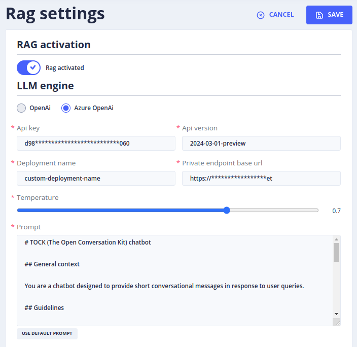
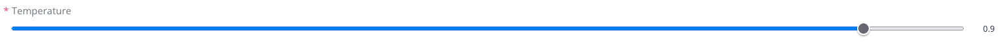

# Activer l'IAGen dans notre bot

> "Okay, you have some skill.", The Matrix Reloaded, Les Wachowski, 2003

## Sommaire

- [Gen AI / RAG Settings](#gen-ai--rag-settings)
  - [Configuration](#configuration)
  - [Activation du RAG & Configuration du LLM Engine]

## Gen AI / RAG Settings
## Configuration

Dans le menu de gauche au niveau **Gen AI** > **RAG Settings** (Retrieving augmented Generation) vous allez pouvoir 
choisir les modèles d'IA générative pris en charge par Tock et de configurer un ensemble de critères spécifiques à chaque fournisseur d'IA.
Cette fonctionnalité permettra à TOCK de générer une réponse à une requête de l'utilisateur, sur la base d'un ensemble de documents intégrés dans une base de données vectorielle.

> Pour accéder à cette page il faut bénéficier du rôle **_botUser_**, role que vous avez en étant admin.

### Activation du RAG & Configuration du LLM Engine

**RAG activation :**
- L’activation n’est possible qu’une fois que tous les champs marqués d’un * sont remplis.
- Une fois les champs remplis, choisir si oui ou non, le bot doit offrir l’option RAG.

**Un provider IA :** (LLM Engine)

- Cette section permet de paramétrer les options liées au modèle IA qui génère la réponse à l’utilisateur.
- Voir la [liste des fournisseurs d'IA](providers/gen-ai-provider-llm-and-embedding.md)

**Température :**

- On peut définir une température située entre 0 et 1.
- Celle-ci permet de déterminer le niveau de créativité du Bot dans la réponse apportée à une requête qui lui est envoyée.

**Prompt :**

- Le prompt est le script qui détermine la personnalité du Bot, le contexte dans lequel il doit répondre, la façon dont il doit s’adresser à l’utilisateur, les recommandations ou instructions de réponses, les styles et formats de réponses.
