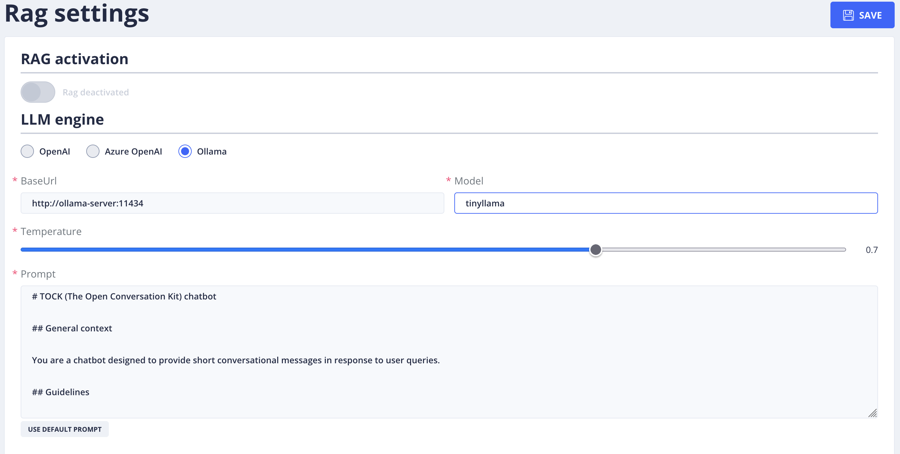
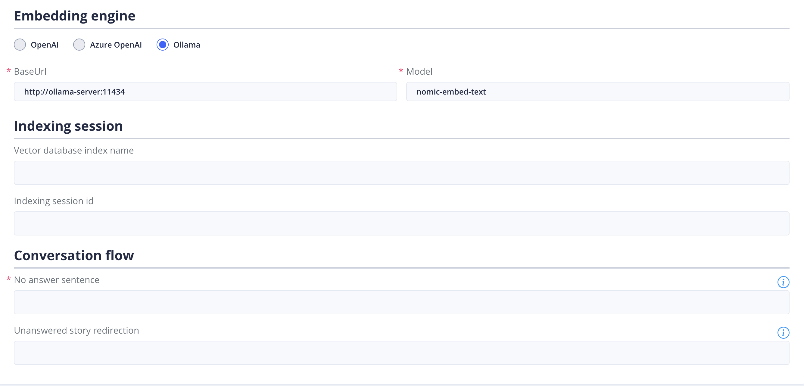
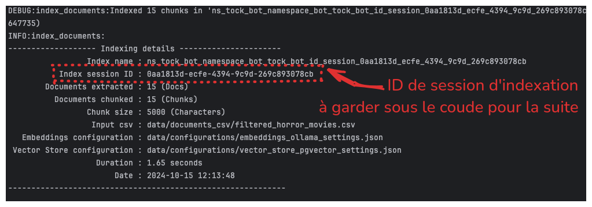

# Activer l'IAGen dans notre bot

> "Okay, you have some skill.", The Matrix Reloaded, Les Wachowski, 2003

## Sommaire

- [Gen AI / RAG Settings](#gen-ai--rag-settings)
  - [Configuration](#configuration)
    - [LLM Engine](#llm-engine)
      - [Configurer Ollama pour LLM Engine](#configurer-ollama-pour-llm-engine)
      - [Configurer OpenAi pour LLM Engine](#configurer-openai-pour-llm-engine)
      - [Configurer AzureOpenAI pour LLM Engine](#configurer-azureopenai-pour-llm-engine)
    - [Emdedding](#emdedding)
      - [Configurer Ollama pour Emdedding](#configurer-ollama-pour-emdedding)
      - [Configurer OpenAi pour Emdedding](#configurer-openai-pour-emdedding)
      - [Configurer AzureOpenAI pour Emdedding](#configurer-azureopenai-pour-emdedding)
  - [Configuration final et activation](#configuration-final-et-activation)
- [Étape suivante](#étape-suivante)

## Gen AI / RAG Settings
## Configuration

Dans le menu de gauche au niveau **Gen AI** > **RAG Settings** (Retrieving augmented Generation) vous allez pouvoir 
choisir les modèles d'IA générative pris en charge par Tock et de configurer un ensemble de critères spécifiques à chaque fournisseur d'IA.
Cette fonctionnalité permettra à TOCK de générer une réponse à une requête de l'utilisateur, sur la base d'un ensemble de documents intégrés dans une base de données vectorielle.

> Pour accéder à cette page il faut bénéficier du rôle **_botUser_**, role que vous avez en étant admin.

### Activation du RAG & Configuration du LLM Engine

**RAG activation :**
- L’activation n’est possible qu’une fois que tous les champs marqués d’un * sont remplis.
- Une fois les champs remplis, choisir si oui ou non, le bot doit offrir l’option RAG.

**Un provider IA :** (LLM Engine)

- Cette section permet de paramétrer les options liées au modèle IA qui génère la réponse à l’utilisateur.
- Voir la [liste des fournisseurs d'IA](providers/gen-ai-provider-llm-and-embedding.md)

**Température :**

- On peut définir une température située entre 0 et 1.
- Celle-ci permet de déterminer le niveau de créativité du Bot dans la réponse apportée à une requête qui lui est envoyée.

**Prompt :**

- Le prompt est le script qui détermine la personnalité du Bot, le contexte dans lequel il doit répondre, la façon dont il doit s’adresser à l’utilisateur, les recommandations ou instructions de réponses, les styles et formats de réponses.

### Configurer Ollama pour LLM Engine
Pour connecter ollama à Tock studio, il vous faut renseigner l’accès à Ollama via cette url d’accès (**BaseUrl**) : http://ollama-server:11434. 
Pour le modèle (**Model**), là c’est à vous de renseigner le nom du modèle que vous utilisez dans ce CodeLab (ici nous avons tinyllama). Enfin pour la température, vous pouvez laisser la valeur par défaut à 0.7.

### Configurer OpenAi pour LLM Engine

Si vous souhaitez utiliser openAI, vous devez vous inscrire sur la plateforme [OpenAI](https://platform.openai.com/docs/introduction)
pour obtenir une clé d'API. Une fois cela fait rendez-vous à cette page [https://platform.openai.com/api-keys](https://platform.openai.com/api-keys) pour générer votre clé d'API.

Dès que vous avez votre clé d'API, vous pouvez la renseigner dans le champ **API Key** et choisir le model (**Model name**) que vous souhaitez utiliser.
Par exemple vous pourriez avoir ce genre de rendu.

### Configurer AzureOpenAI pour LLM Engine

Si vous souhaitez utiliser Azure OpenAI, vous devez vous inscrire sur la plateforme
[Azure OpenAI](https://azure.microsoft.com/fr-fr/products/ai-services/openai-service) et d'avoir un compte professionnel  
afin d'avoir une clé d'API.
Une fois cela fait, vous pouvez renseigner votre clé d'API dans le champ **API Key** et choisir le model (**Model name**)
que vous souhaitez utiliser.

### Emdedding

### Configurer Ollama pour Emdedding

Pour connecter ollama à Tock studio sur la partie embedding, il vous faut renseigner l’accès à Ollama via cette url d’accès (**BaseUrl**) : http://ollama-server:11434.
Pour le modèle (**Model**), là c’est à vous de renseigner le nom du modèle que vous utilisez dans ce CodeLab 
(ici nous avons **nomic-embed-text**).

Pour le reste de configuration, nous vous invitons à aller directement au chapitre [Configuration final et activation](#configuration-final-et-activation)

### Configurer OpenAi pour Emdedding

Si vous souhaitez utiliser openAI, vous devez vous inscrire sur la plateforme [OpenAI](https://platform.openai.com/docs/introduction)
pour obtenir une clé d'API. Une fois cela fait rendez-vous à cette page [https://platform.openai.com/api-keys](https://platform.openai.com/api-keys) 
pour générer votre clé d'API.

Dès que vous avez votre clé d'API, vous pouvez la renseigner dans le champ **API Key** et choisir le model 
(**Model name**) actuellement disponible : **text-embedding-ada-002**.
Par exemple vous pourriez avoir ce genre de rendu.

Pour le reste de configuration, nous vous invitons à aller directement au chapitre [Configuration final et activation](#configuration-final-et-activation)

### Configurer AzureOpenAI pour Emdedding

Si vous souhaitez utiliser Azure OpenAI, vous devez vous inscrire sur la plateforme
[Azure OpenAI](https://azure.microsoft.com/fr-fr/products/ai-services/openai-service) et d'avoir un compte professionnel  
afin d'avoir une clé d'API.
Une fois cela fait, vous pouvez renseigner votre clé d'API dans le champ **API Key** et choisir le model (**Model name**)
que vous souhaitez utiliser.

Pour le reste de configuration, nous vous invitons à aller directement au chapitre [Configuration final et activation](#configuration-final-et-activation)

### Configuration final et activation
Cette partie s’attarde sur les intitulés **Indexing session** et **Conversation flow**.

En [Étape 4](step_4.md), vous avez réalisé une ingestion de données, via un programme en python.
Normalement, si l’ingestion a été correctement réalisé le programme a terminé avec un succès qui affiche des Id, comme dans l’exemple suivant :

Dans ce résultat, vous avez une variable nommée **Index session ID** qui fournit un identifiant unique.
Copier cet identifiant pour le coller dans le champ **Indexing session id**.

Dans l’intitulé **Conversation flow** et dans le champ **No answer sentence**, vous devez spécifier une phrase lorsque l’IA n’est pas capable de répondre.
Par la même occasion, vous pouvez aussi rediriger vers une story spécifique dans le champ **Unanswered story redirection**

Une fois que vous avez configuré les différents paramètres, vous pouvez activer le RAG en cliquant sur le bouton **Save**.
## Étape suivante

- [Étape 6](step_6.md)
