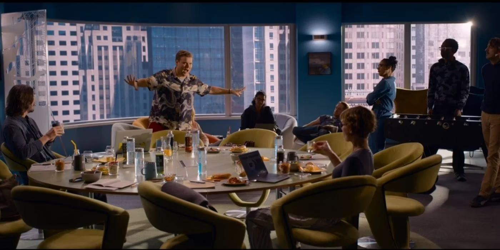

# Connecter notre bot à notre boutique

> "How do you know if you want something yourself or if your upbringing programmed you to want it?", The Matrix Resurrections, Lana Wachowski, 2021

Le but de cette partie est de brancher notre bot sur une page web de notre boutique, et coder un peu pour que le bot puisse répondre à des questions sur les produits de la boutique.

## Sommaire

- [Lancer notre page web](#lancer-notre-page-web)
- [Brancher notre bot sur la page web](#brancher-notre-bot-sur-la-page-web)
- [Tester notre bot](#tester-notre-bot)

## Lancer notre page web

Pour lancer notre boutique d'hallooween, nous allons utiliser la page web [index.html](index.html).
Boutique spécial hallooween, avec des produits spéciaux pour l'occasion. Toutefois ce qui nous intéresse ici c'est de
brancher notre bot sur cette page web. Vous devriez voir quelque chose comme ça:

