# Bonus - Observabilité

<br/>
<u>Objectifs:</u>

- Découvrir langfuse, création d'un compte, projet et clé d'API
- Configurer langfuse dans tock

## Sommaire

- [ Gen AI - Observability Settings](#gen-ai---observability-settings)
    - [Accéder à Langfuse](#accéder-à-langfuse)
    - [Créer une nouvelle organisation](#créer-une-nouvelle-organisation)
    - [Créer un nouveau projet](#créer-un-nouveau-projet)
    - [Récupérer les clés d'API](#récupérer-les-clés-dapi)


- [Langfuse et Tock Studio](#langfuse-et-tock-studio)
    - [Connecter Tock Studio à Langfuse](#connecter-tock-studio-à-langfuse)
    - [générer des phrases d'entraînement](#générer-des-phrases-dentraînement)
    - [Voir les traces dans Langfuse](#voir-les-traces-dans-langfuse)


# Gen AI - Observability Settings

- L'observabilité des modèles de langage (LLM Observability) aide à surveiller, d'analyser et de comprendre le comportement des modèles de langage à grande échelle.
- Cela inclut la collecte de données sur leurs performances, la détection d'anomalies et la compréhension des erreurs qu'ils peuvent produire.
- L'objectif est de garantir que ces modèles fonctionnent de manière fiable, transparente, en fournissant des informations qui permettent d'améliorer leur performance et de corriger les problèmes potentiels.

## Docker, lancer le service langfuse

Dans le fichier `docker/docker-compose.yml` décommenter la block `langfuse-server:` et relancer un :
```bash
cd docker
source .env
docker compose -p devfest_tock up -d
```

## Accéder à Langfuse
Pour accéder à la plateforme Langfuse, rendez à l'adresse suivante http://localhost:3000/.

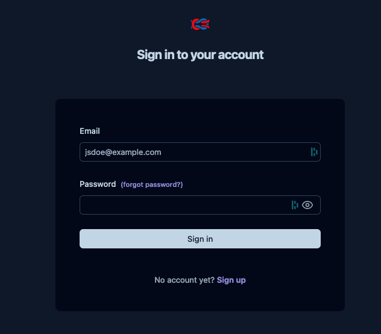

Là vous allez devoir créer un accés, en cliquant sur le bouton **Sign Up** vous allez être redirigé vers la page de création de compte.

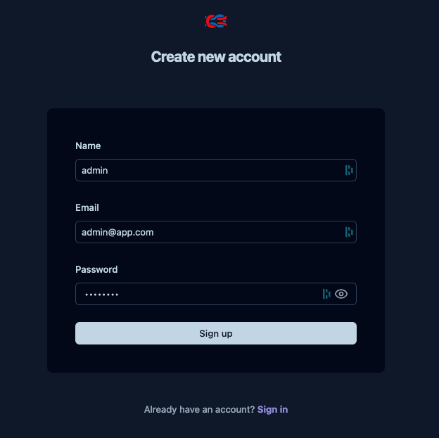

Dans notre cas, nous allons utiliser le login **admin**, l'email **admin@app.com** et le mot de passe **password** (ces éléments sont donnés à titre d'exemple, vous pouvez utiliser les vôtres).
Une fois que vous avez rempli les champs, cliquez sur le bouton **Sign Up**.

## Créer une nouvelle organisation

Une fois que vous avez créé votre compte, vous allez être redirigé vers la page principale de l’espace admin qui ressemble à celle-ci.

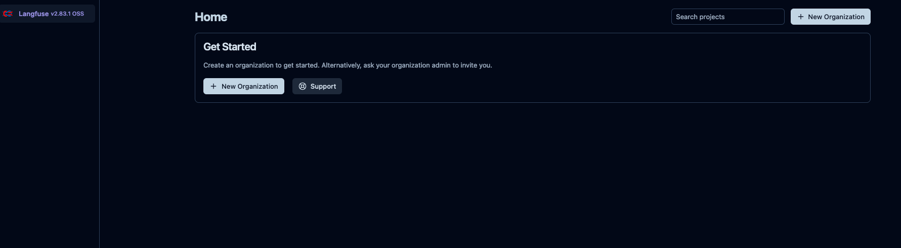

Là vous allez cliquer sur **New Organization**, et lui donner un nom. Dans notre cas, se sera **codelab-tock-2024**, puis de cliquer sur **Create**.
Vous devriez voir votre nouvelle organisation apparaitre dans la liste des organisations, comme ci-dessous.

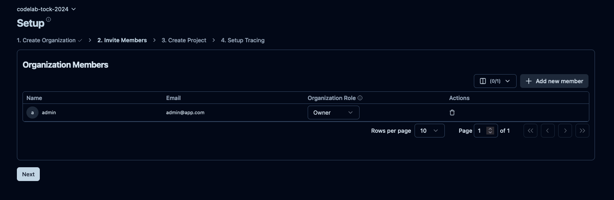

Ensuite vous allez cliquer sur le bouton **Next**.

## Créer un nouveau projet
Là vous allez définir le nom de votre nouveau projet. Dans notre cas, se sera codelab-tock-project, puis de cliquer sur **Create**.
Vous devriez voir une nouvelle page apparaitre avec les informations de votre projet.

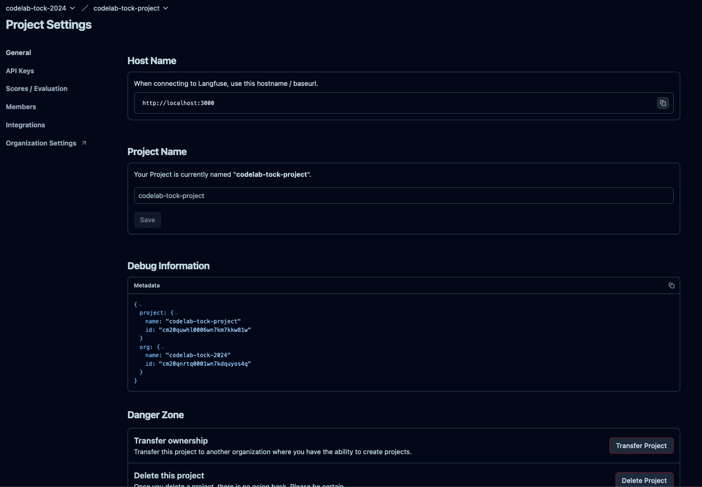

## Récupérer les clés d'API
Sur la page de votre projet, cliquer sur l’onglet API Keys, pour être rediriger sur la page qui centralise toutes les 
clés d’api de votre projet. La liste étant vide, il faut cliquer sur le bouton **+ Create new API keys**.

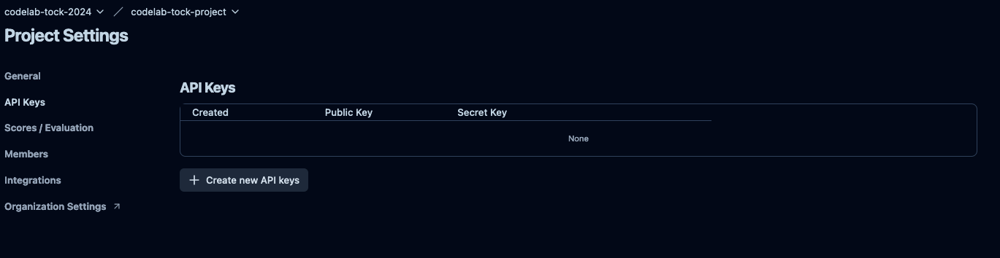

Dès lors, vous allez voir apparaitre une pop-up qui contient les listes d’API-key, comme dans l’exemple suivant :

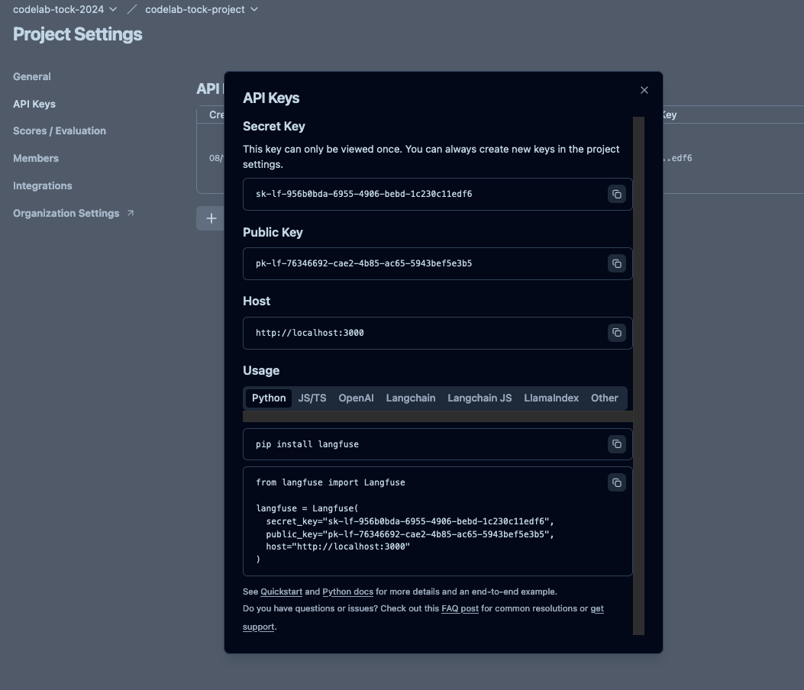

>Ne fermez pas cette pop-up car vous allez en avoir besoin pour connecter Tock à Langfuse !


## Langfuse et Tock Studio

Dans cette partie, nous allons voir comment connecter Tock Studio à Langfuse pour observer les performances du modèle.


## Connecter Tock Studio à Langfuse

Dans Tock Studio, allez dans le menu de gauche dans **Gen AI** > **Observability settings** pour arriver sur cette page

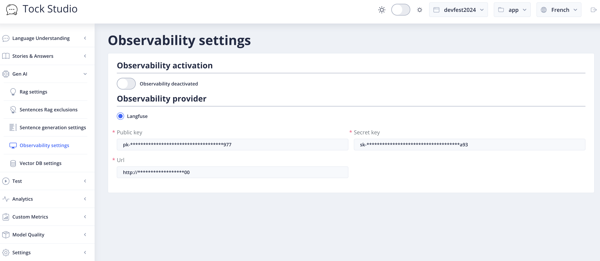

Remplissez les différents champs, de cet écran avec la clé publique et sécrète qui est disponible depuis la pop-up 
dans l’interface Langfuse.

Pour l'url d'accès à Langfuse vous devez renseigner cette url: http://langfuse-server:3000

## Voir les traces de génération de phrases

Maintenant allez sur tableau de bord de Langfuse (http://localhost:3000/) pour voir les traces.

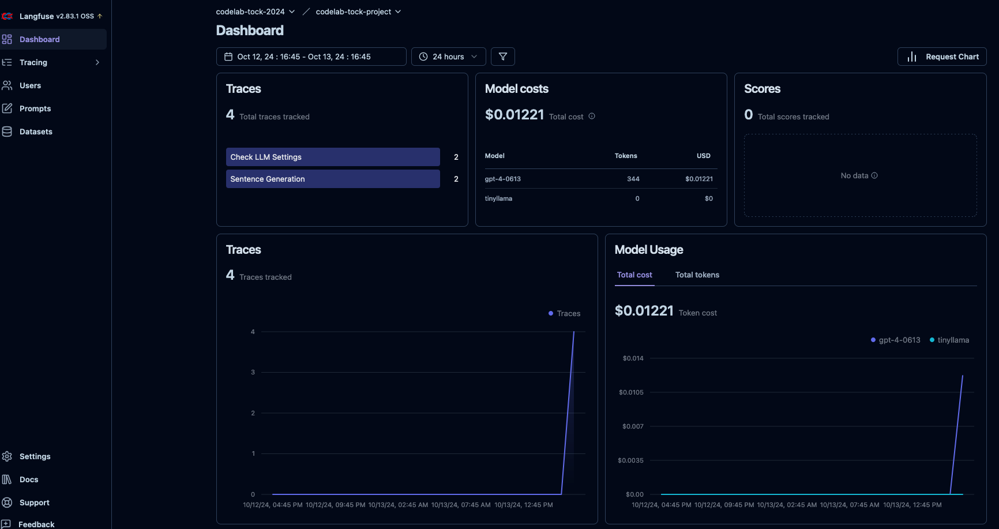

Dans le menu de gauche, allez dans **Tracing** > **Traces** pour arriver sur ce tableau.

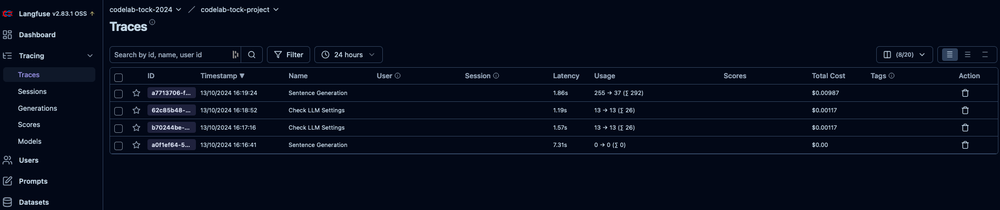

Là, vous allez choisir l’élément dont le nom contient **Sentence Generation**, cliquer sur l’**ID**de ce même élément 
et vous pourrez voir les détails de la génération de phrases ou de mots de cette action.

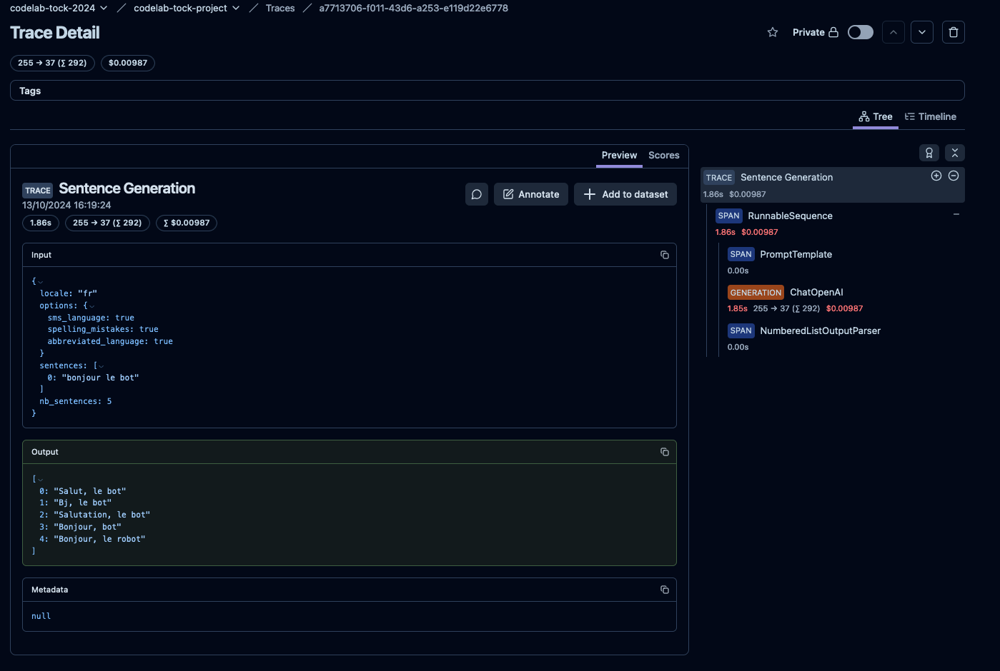

> **Note :** Les éléments varient en fonction de la demande et du type de LLM qui est utilisé pour produire un résultat demandé

Vous y retrouverez aussi les traces des chaines RAG, ce qui vous permet de voir les documents retrouvés cotés base documentaire, les différents prompts qui s'enchainent (effet mémoire...).


## Étape suivante

- [Thanks](./thanks-you.md)
